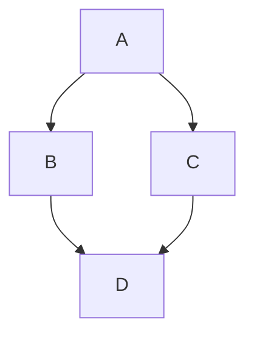

# reverse_engineering_notes
an educational sample for selecting tools and methods to get started with reverse engineering. Updated periodically.

This repository provides some general methodology and a lot of references for how to get started with reverse engineering. It is for educational use only, so (code) examples included in this repository will be focused on tool usage only. 

The two main components of this repository, affectionally referred to as [`The Flow Chart`](#the-flow-chart) and [`The Table`](#the-table), are part of the [`Tool-Problem-Device Method`](#tool-problem-device-method) described below.  These are meant as informational references for how different parts of the reverse engineering process are related, and to show where some popular tools fit into the process. 

As a general disclaimer, do not attempt to access or interface any device or network that you do not own or have explicit permission to work with. Unauthorized access to a system, network, or device may have legal repercussions. Some methodology is destructive and will void any warranties. The tools and software demonstrated in this repository is not an endorsement of any particular tool. This is also not a shopping list; not all tools are needed for all problems. 

## Table of Contents
* [Requirements](#requirements)
* [Reverse Engineering](#reverse-engineering)
  * [What is Reverse Engineering?](#what-is-reverse-engineering)
  * [Getting Started with Reverse Engineering](#getting-started-with-reverse-engineering)
* [Tool-Problem-Device Method](#tool-problem-device-method)
  * [Tools](#tools)
    * [Selecting a Tool](#selecting-a-tool)
    * [DIY vs. Purchase](#diy-vs-purchase)
  * [Problems](#problems)
    * [Identifying a Problem](#identifying-a-problem)
  * [Devices](#devices)
    * [Selecting a Device](#selecting-a-device)
* [The Flow Chart](#the-flow-chart)
* [The Table](#the-table)
* [References](#references)

## Requirements

Most of this repository does not require code dependencies due to it being primarily resources. However, select examples will be added to demonstrate some basic tool usage. In cases where tools are being demonstrated via code, there will be a designated directory in the `src` directory with a local `README` and `requirements.txt`

## Reverse Engineering
### What is Reverse Engineering?

Reverse engineering is the process of analyzing a technology through a systematic process of research and physical analysis to understand the design, function, and operation. This can be applied to product, system, network, software, device, etc., and may involve physical disassembly to examine and interface with specific components. A primary goal of reverse engineering is extracting information from the technology itself in order to understand it, recreate it, identify vulnerabilities, and/or improve upon it. There are applications for interoperability, device development, security research, education, and technology improvement.

Techniques for reverse engineering can be applied across numerous fields. In software, this may mean analyzing compiled code to understand algorithms or operation, locating vulnerabilities, or to create compatible software/APIs. Hardware (and firmware extraction) applications may require disassembly of a physical enclosure (if it exists), or even isolating (removing) integrated circuit chips from the main circuit to extract firmware or other information. 

This repository focuses on general techniques and tools rather than going into the details of software and hardware disassembly. Before physically disassembling a device, it is recommended to document all external markings and features, and to do cursory research to understand if any part of the process is destructive. Some steps in the disassembly, such as cutting open an enclosure, are destructive in nature but harmful to the device operation. Other steps, such as opening a case too quickly seem benign but may break ribbon cables or rip contacts from circuity. 

### Getting Started with Reverse Engineering

The kind of physical and digital tools needed for reverse engineering are highly dependent on the situation. Software-focused work may require no hardware aside from a computer and an IDE, or it may require both hardware and expensive measurement equipment. Hardware may need nothing more than a multimeter for basic circuit analysis. 

The [`Tool-Problem-Device Method`](#tool-problem-device-method) section is designed to help narrow down tools and approaches based on the starting information. [`The Flow Chart`](#the-flow-chart) is a visualization of how some (not all) reverse engineering methods are related, while [`The Table`](#the-table) provides links to supporting tools, software, references, etc. mentioned in this repository. 

This information is not a replacement for a solid `documentation method`, building strong foundational knowledge, or getting hands-on experience. Reverse engineering is very domain-knowledge heavy in its implementation and many people will specialize in one (or several) areas due to the broad scope of the field. While there are many topics that fall under Reverse Engineering, there are several key skills to being able to work across the full attack surface of a device:
* Functional knowledge of computer architecture
* Operating system basics and navigation
* Understanding and manipulating file formats
* Working with network protocols and understanding when they are used
* Functional knowledge in at least one programming language, though languages such as C, Python, and Assembly are common
* Locating and reading commercial data sheets to identify circuit component information

## Tool-Problem-Device Method

The `Tool-Problem-Device Method` used here is a general technique for answering the following questions:
* Where am I starting?
* What am I working with? 
* What am I trying to accomplish?

With this method, you have three components: a tool, a problem, or a device. You choose one of those components, and that decision influences the other two. For instance, if you want to learn how to use a `JTAG enumerator` or `serial to RS232` reader, then you need to find a device with those interfaces. Knowing the tool and the device, your starting problem is then something similar to "how do I get data" or "how do I make the serial connection". If, instead, you start with a device such as a `Bluetooth wearable heartrate sensor`, then your problem may be "how do I get Bluetooth data" and your tool will need to be selected to collect and/or decode that data.

This is, of course, a simplification of the possible scope. In this method, a `device` could be represented by a piece of target software, a circuit component, or other device under test (DUT) being investigated. It is a system, network, program, or physical device that some action is being taken against. Knowing the three components of the Tool-Problem-Device Method makes it possible to then begin identifying the scope, limitations, and constraints of the reverse engineering task.

* Where am I starting?
  * The tools and resources available
  * The identified 'device' being investigated
* What am I working with? 
  * The limitations (can only look at software, can open the device, cannot remove chips, no live demos)
  * The constraints (time, money, device must be returned)
* What am I trying to accomplish?
  * Getting data, getting firmware, getting memory
  * Creating documentation for a project about to be improved
  * Creating an interface API to expand functionality

In the real world, you may be given the device or problem (and thus the constraints) in a work environment. Your job will then be how to select the tool or tools in order to address the problem and stay within the imposed limits and constraints. 

### Tools
#### Selecting a Tool
#### DIY vs. Purchase

### Problems
#### Identifying a Problem

### Devices
#### Selecting a Device

## The Flow Chart

mermaid markdown test

## The Table

 * basic tools that should be available when working with any hardware:

* Some software tools:
  * free vs paid
  * debuggers, hex editors, 

* Insert table here for more detailed tool descriptions 

### Computer & Operating System
  * Tablets, laptop, desktop
  * Mac, Windows, Linux

## Documentation Methods

## Practice Tools

* pull the list of practice CTFs, walk throughs, and other examples from Slack
* There's some GitHub and other open-source references

## References

