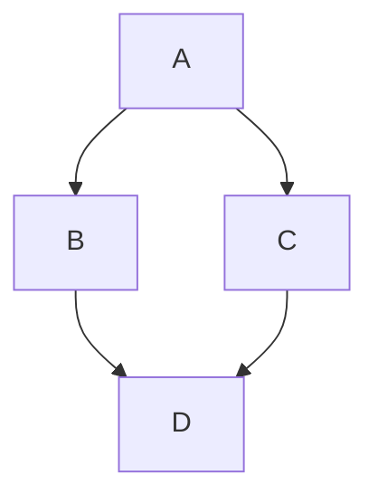

# reverse_engineering_notes
an educational sample for selecting tools and methods to get started with reverse engineering

mermaid markdown test

```mermaid
graph TD;
    A-->B;
    A-->C;
    B-->D;
    C-->D;
```
