# reverse_engineering_notes

> **Status:** Actively maintained and periodically updated as the public half of the documentation for an undergraduate elective course. The methodology, topic sections, and tool tables are in place; individual sections continue to grow over time. Last reviewed: July 2026.

An educational sample for selecting tools and methods to get started with reverse engineering. Updated periodically. This is the public half of the documentation used in an undergraduate elective course.

This repository provides some general methodology and a lot of references for how to get started with reverse engineering. It is for educational use only, so (code) examples included in this repository will be focused on tool usage only.

The two main components of this repository, affectionately referred to as [`The Flow Chart`](#the-flow-chart) and [`The Table`](#the-table), are part of the [`Tool-Problem-Device Method`](#tool-problem-device-method) described below. These are meant as informational references for how different parts of the reverse engineering process are related, and to show where some popular tools fit into the process.

A note on this method: `you do NOT need to own or use all (or any) of the tools presented here`. A key component of these notes is to introduce that these tools and methods exist. There is no singular 'best' way to address most reverse engineering problems. When used as a guide, this document is meant to introduce you to examples and ideas that **exist** and to make it possible to **ask useful questions** in your process. 

As a general disclaimer, do not attempt to access or interface with any device or network that you do not own or have explicit permission to work with. Unauthorized access to a system, network, or device may have legal repercussions. Some methodology is destructive and will void any warranties. The tools and software demonstrated in this repository are not an endorsement of any particular tool. This is also not a shopping list; not all tools are needed for all problems.

> **Companion material:** deeper reference notes live in [`docs/SUPPLEMENTARY_NOTES.md`](docs/SUPPLEMENTARY_NOTES.md) — legal & ethics, lab/VM setup, OSINT, FCC ID lookups, computer/file-format notes, responsible disclosure, practice resources/CTFs, and hands-on demo ideas. That material is being promoted into this README over time; until then, the companion file is the fuller reference.

## Table of Contents

- [Requirements](#requirements)
- [Reverse Engineering](#reverse-engineering)
  * [What is Reverse Engineering?](#what-is-reverse-engineering)
  * [Getting Started with Reverse Engineering](#getting-started-with-reverse-engineering)
- [Tool-Problem-Device Method](#tool-problem-device-method)
- [The Flow Chart](#the-flow-chart)
  * [Hardware Analysis](#hardware-analysis)
  * [Code Analysis](#code-analysis)
  * [Wireless Analysis](#wireless-analysis)
  * [Network Analysis](#network-analysis)
- [The Table](#the-table)
- [Documentation Methods](#documentation-methods)
- [Bookshelf](#bookshelf)
- [Glossary](#glossary)
- [References](#references)
- [License](#license)

## Requirements

Most of this repository does not require code dependencies due to it being primarily resources. However, select examples will be added to demonstrate some basic tool usage. In cases where tools are being demonstrated via code, there will be a designated directory in the `src` directory with a local `README` and `requirements.txt`.

## Reverse Engineering

### What is Reverse Engineering?

Reverse engineering is the process of analyzing a technology through a systematic process of research and physical analysis to understand the design, function, and operation. This can be applied to a product, system, network, software, device, etc., and may involve physical disassembly to examine and interface with specific components. A primary goal of reverse engineering is extracting information from the technology itself in order to understand it, recreate it, identify vulnerabilities, and/or improve upon it. There are applications for interoperability, device development, security research, education, and technology improvement.

Techniques for reverse engineering can be applied across numerous fields. In software, this may mean analyzing (de)compiled code to understand algorithms or operation, locating vulnerabilities, or creating compatible software/APIs. Hardware (and firmware extraction) applications may require disassembly of a physical enclosure (if it exists), or even isolating (removing) integrated circuit chips from the main circuit to extract firmware or other information.

This repository focuses on general techniques and tools rather than going into the details of software and hardware disassembly. Before physically disassembling a device, it is recommended to document all external markings and features, and to do cursory research to understand if any part of the process is destructive. Some steps in the disassembly, such as cutting open an enclosure, are destructive in nature but not harmful to the device operation. Other steps, such as opening a case too quickly, seem benign but may break ribbon cables or rip contacts from circuitry. Care should be taken at all steps of this process to document and prevent early or unintentional destruction of device functionality.

### Getting Started with Reverse Engineering

The physical and digital tools needed for reverse engineering are highly dependent on the situation. Software-focused work may require no hardware aside from a computer running an IDE, or it may require both hardware and expensive measurement equipment. Hardware may need nothing more than a multimeter for basic circuit analysis, or it may need a specialized chip-removal tool in order to isolate and test components.

The [`Tool-Problem-Device Method`](#tool-problem-device-method) section is designed to help narrow down tools and approaches based on the starting information. [`The Flow Chart`](#the-flow-chart) is a visualization of how some (not all) reverse engineering methods are related, while [`The Table`](#the-table) provides links to supporting tools, software, references, etc. mentioned in this repository. The chart and table have been altered from their original format to make them more markdown/README friendly, but the information is still there!

The tool information in this repository is not a replacement for a solid `documentation method`, building strong foundational knowledge, or getting hands-on experience. Reverse engineering is very domain-knowledge heavy in its implementation, and many people will specialize in one (or several) areas due to the broad scope of the field. While there are many topics that fall under reverse engineering, there are key cross-domain skills needed to work across the full attack surface of a device:

- Operating system basics and navigation
- Understanding and manipulating file formats
- Familiarity with network protocols and understanding when they are used
- Functional knowledge of computer architecture, especially how data is moved and stored across different components
- Functional knowledge in at least one programming language, though languages such as C, Assembly, Java, and Python are common
- Scripting and automation for repeating tests and validating collected data
- Creating a proper virtual machine and/or environment setup for isolated, reproducible analysis environments
- Locating and reading commercial datasheets to identify circuit component information
- Literacy of circuit diagrams and components
- Basic soldering and electronics skills
- Knowledge and `implementation` of best safety practices when working with electricity

This is not an exhaustive list (if there ever could be one). The specific topic and attempted problem to be solved will also contribute heavily to prioritization of skills.

> **Caution**
>
> Regarding circuitry and power, an often repeated piece of advice is `If you DON'T KNOW, DON'T GUESS! Look it up!`. If you are working with, or around, hardware with ANY kind of power source (including capacitors!), look up the specs and make sure that you and your equipment are not at risk of electric shock. If you are still unsure after looking it up, find someone and ask!

## Tool-Problem-Device Method

The `Tool-Problem-Device Method` used here is a general technique for answering the following questions:

- Where am I starting?
- What am I working with?
- What am I trying to accomplish?
- What are the benefits of this approach?

With this method, you have three components to consider before answering the above questions: a tool, a problem, and a device. You choose one of those components, and that decision influences the other two. For instance, if you want to learn how to use a `JTAG enumerator` or `serial to RS232` adaptor, then you need to find a device with those interfaces. Knowing the tool and the device, your starting problem is then something similar to "how do I get data" or "how do I make the serial connection". If, instead, you start with a device such as a `Bluetooth wearable heart rate sensor`, then your problem may be "how do I get Bluetooth data" and your tool will need to be selected to collect and/or decode that data.

This is, of course, a simplification of the possible scope. In this method, a `device` could be represented by a piece of target software, a circuit component, or another device under test (DUT) being investigated. It is a system, network, program, or physical device that some action is being taken against. Knowing the three components of the Tool-Problem-Device Method makes it possible to then begin identifying the scope, limitations, and constraints of the reverse engineering task.

- Where am I starting?
  * The tools and resources available
  * The identified 'device' being investigated
  * Topic knowledge & depth of the researchers, including skills that might need to be learned and tested during investigation
- What am I working with?
  * The limitations (can only look at software, can open the device, cannot remove chips, no live demo or data)
  * The constraints (time, money, device must be returned)
  * **Safety!** Check what kind of safety precautions need to be taken
    + This includes electrical shock risk to people and equipment, fire risk (especially with internal batteries), and malware exposure to larger research systems
- What am I trying to accomplish?
  * Getting data, getting firmware, getting memory
  * Creating documentation for a project about to be adopted by a company
  * Creating an interface API to expand functionality
- What are the benefits of this approach?
  * How reproducible is the approach, and how accurate is the data or documentation
  * Reasons for choosing destructive over non-destructive methods
  * Reasons for a DIY tool or larger purchase, vs. using something standard
  * Who is benefiting from this knowledge or these actions (identifying stakeholders)

These questions are important to begin establishing a scope, constraints and limitations, objectives, and stakeholders. For a personal project, you can be a stakeholder and the benefit of the project can be purely educational. In the real world, you may be given the device or problem (and thus the constraints) in a work environment. Your job will then be how to select the tool or tools in order to address the problem and stay within the imposed limits and constraints. The `Tool-Problem-Device` method still holds up.

The following sections contain some notes for choosing tools, identifying and articulating problems, and choosing devices. The [Flow Chart](#the-flow-chart) and [Table](#the-table) sections go into more detail about specific tools and approaches.

## The Flow Chart

`The Flow Chart` (all caps) is the affectionate nickname given to the constantly referenced chart of how select topics in reverse engineering are related or use similar tools. This version is simplified a little so it can be formatted in this README, but the information is still there (just maybe linked to a table in the next section for completeness).

The Flow Chart starts off with 4 core topics:

- Wireless Analysis
- Code Analysis
- Hardware Analysis
- Network Analysis

Within each of those topics are a series of sub-topics, and then eventually some tools and examples. Sub-topics are not meant to be insular, and they often rely on information gathered by methods under the parent topic.

As you become more adept at reverse engineering, you WILL need skills built across all four topics. Reverse engineering is not an insular field and often relies heavily on domain knowledge, hands-on skills, and the ability to do research quickly in order to appraise the validity of an approach. These are all things that are built up over time.

In the chart below, clicking on a sub-topic block will redirect either to a subsection with more information on the topic, or the respective table if clicking a block listing tools. These are not exhaustive lists and are meant as a starting point. There are undoubtedly other good tools that exist for specific purposes that may not have been included in this list.

```mermaid
graph LR;
    A[Reverse Engineering] --> B[Hardware Analysis]
    A --> C[Code Analysis]
    A --> D[Wireless Analysis]
    A --> E[Network Analysis]

    B --> B1[Physical Device Access]
    B --> B2[Circuit Investigation]
    B --> B3[Component ID]
    B --> B4[PCB Layout]
    B --> B5[Signal Analysis]
    B --> B6[Power Analysis]
    B --> B7[Side-channel Analysis]
    B --> B8[Fault Injection]

    C --> C1[Software]
    C --> C2[Firmware]
    C --> C3[Embedded]
    C --> C4[Mobile]
    C --> C5[Web Applications]
    C --> C6[Malware Analysis]

    D --> D1[WiFi]
    D --> D2[Bluetooth]
    D --> D3[RFID/NFC]
    D --> D4[Sub-GHz/ISM]
    D --> D5[Cellular/Mobile]
    D --> D6[IoT Protocols]

    E --> E1[Protocol Analysis]
    E --> E2[Packet Capture]
    E --> E3[Network Security]
    E --> E4[Industrial/IoT Protocols]
    E --> E5[Network Infrastructure]
    E --> E6[Network Forensics]

    style A fill:#87ceeb,color:#000
    style B fill:#dda0dd,color:#000
    style C fill:#98fb98,color:#000
    style D fill:#f0c674,color:#000
    style E fill:#f08080,color:#000

    click B href "https://github.com/LC-Linkous/reverse_engineering_notes#hardware-analysis"
    click C href "https://github.com/LC-Linkous/reverse_engineering_notes#code-analysis"
    click D href "https://github.com/LC-Linkous/reverse_engineering_notes#wireless-analysis"
    click E href "https://github.com/LC-Linkous/reverse_engineering_notes#network-analysis"
    click B1 href "https://github.com/LC-Linkous/reverse_engineering_notes#physical-device-access"
    click B2 href "https://github.com/LC-Linkous/reverse_engineering_notes#circuit-investigation"
    click B3 href "https://github.com/LC-Linkous/reverse_engineering_notes#component-id"
    click B4 href "https://github.com/LC-Linkous/reverse_engineering_notes#pcb-layout"
    click B5 href "https://github.com/LC-Linkous/reverse_engineering_notes#signal-analysis"
    click B6 href "https://github.com/LC-Linkous/reverse_engineering_notes#power-analysis"
    click B7 href "https://github.com/LC-Linkous/reverse_engineering_notes#side-channel-analysis"
    click B8 href "https://github.com/LC-Linkous/reverse_engineering_notes#fault-injection"
    click C1 href "https://github.com/LC-Linkous/reverse_engineering_notes#software"
    click C2 href "https://github.com/LC-Linkous/reverse_engineering_notes#firmware"
    click C3 href "https://github.com/LC-Linkous/reverse_engineering_notes#embedded"
    click C4 href "https://github.com/LC-Linkous/reverse_engineering_notes#mobile"
    click C5 href "https://github.com/LC-Linkous/reverse_engineering_notes#web-applications"
    click C6 href "https://github.com/LC-Linkous/reverse_engineering_notes#malware-analysis"
    click D1 href "https://github.com/LC-Linkous/reverse_engineering_notes#wifi"
    click D2 href "https://github.com/LC-Linkous/reverse_engineering_notes#bluetooth"
    click D3 href "https://github.com/LC-Linkous/reverse_engineering_notes#rfidnfc"
    click D4 href "https://github.com/LC-Linkous/reverse_engineering_notes#sub-ghzism"
    click D5 href "https://github.com/LC-Linkous/reverse_engineering_notes#cellularmobile"
    click D6 href "https://github.com/LC-Linkous/reverse_engineering_notes#iot-protocols"
    click E1 href "https://github.com/LC-Linkous/reverse_engineering_notes#protocol-analysis"
    click E2 href "https://github.com/LC-Linkous/reverse_engineering_notes#packet-capture"
    click E3 href "https://github.com/LC-Linkous/reverse_engineering_notes#network-security"
    click E4 href "https://github.com/LC-Linkous/reverse_engineering_notes#industrialiot-protocols"
    click E5 href "https://github.com/LC-Linkous/reverse_engineering_notes#network-infrastructure"
    click E6 href "https://github.com/LC-Linkous/reverse_engineering_notes#network-forensics"
```

### Hardware Analysis

Hardware analysis is the process of examining a physical piece (or pieces) of hardware for information on the device's operation. This is typically the first step in the reverse engineering process as it provides initial information about the device, interfacing, manufacturer, and potential starting points.

This part of the process may include disassembly of the enclosure or device to get a closer look at key components such as circuits, chips, power distribution, and industry-standard interfacing that already exists on the device (i.e., JTAG, SPI, UART, etc.). Studying the physical layout, analyzing the electrical connections between components, and understanding the physical interactions between parts of a device (electrical and mechanical) happens here.

This topic has been split into the following sub-topics:

- [Physical Device Access](#physical-device-access)
- [Circuit Investigation](#circuit-investigation)
- [Component ID](#component-id)
- [PCB Layout](#pcb-layout)
- [Signal Analysis](#signal-analysis)
- [Power Analysis](#power-analysis)
- [Side-channel Analysis](#side-channel-analysis)
- [Fault Injection](#fault-injection)

Common tools for this topic are listed under [General Tools](#general-tools). Signal Analysis and Power Analysis will require some specialized tools compared to the access and identification topics, while Side-channel Analysis and Fault Injection are the more difficult topics listed here.

This section of topics requires some knowledge and skills in:

- Documentation
- Internet research
- Datasheet reading
- Disassembly and hand tools
- Circuit component identification
- Electrical power safety (for people and devices)
- Circuit tracing and PCB design understanding

Signal Analysis, Power Analysis, Side-channel Analysis, and Fault Injection require additional knowledge of:

- Electrical signals and signal processing
- Signal modulation
- Power supply operation
- Oscilloscope operation
- Function generator operation
- Voltage measurement
- Current measurement
- Packet creation and modification
- Protocol identification and interfacing

Some tools and software for these are listed in the [General Tools](#general-tools), [Signal & Bus Analysis Tools](#signal--bus-analysis-tools), and [Side-channel & Fault Injection Tools](#side-channel--fault-injection-tools) tables.

Documentation is extremely important when dealing with hardware analysis. In a professional situation, this establishes the condition of the device at all steps, makes the process replicable, and is a key part of evidence gathering for forensics. Organized documentation is also a key part of component identification and cross-referencing how components interact. Complicated devices may include hundreds of components, multiple daughterboards, and complex circuitry.

---

#### Physical Device Access

Accessing the device is the first step of reverse engineering. Some devices are encased in tamper-resistant enclosures, while others are simple to open or may have no enclosure. Documentation of the disassembly process helps maintain evidence of the process and enables reassembly if needed.

Physical access methods range from simple enclosure (case) removal using standard tools, to complex techniques involving specialized equipment for tamper-resistant devices. Or a hacksaw on a plastic enclosure. Or dissolving epoxy, glues, and other materials without dissolving parts of your connecting components.

**Task Examples**

- Documentation and photography
  * Take detailed photos of the device from multiple angles before opening. Include all labels, serial numbers, external connectors, and anything else that documents the device in the condition you received it in.
- Identify tamper-proof seals or detection methods
  * Document these. When given permission to open or modify the device, tamper-proof seals can be cut through with a sharp blade. Be mindful of components potentially underneath. Screws may have a thread locker (similar to Loctite or another acrylic-based material) to prevent the enclosure from being opened. Pay attention to screws that do not turn easily to prevent stripping the head and needing to tap the device.

> **Tip**
>
> Document markings extensively and go slow when opening an enclosure where you cannot see inside. Cables, wires, and other connectors may be SHORT and can break if accidentally pulled.

---

#### Circuit Investigation

Circuit investigation involves finding all of the electrical pathways (wires, traces, etc.) within and to a device. This is typically done to understand the power distribution, location of major components such as memory storage or actuators, and to identify where potential manufacturer interfacing (JTAG, SPI, etc.) may exist for other steps in the reverse engineering process.

The process typically begins with identification of PCBs, daughterboards, and modular control components. Inspecting PCB traces and major component placement can lead to the [identification of important components](#component-id), initial information for [power analysis](#power-analysis), and other information to prioritize follow-up investigation.

Using a multimeter for continuity testing helps increase the accuracy and speed for identifying paths in both wires and traces. Understanding circuit components and their operation is a key factor in identifying differences in behavior when the circuit is powered ON, powered OFF, or when components are isolated for information extraction.

**Task Examples**

- Continuity testing
  * Use a multimeter to map electrical connections between components, test points, and connectors
- Power rail identification
  * Trace power distribution networks and identify voltage levels at different circuit nodes
- Ground plane identification
  * Trace power and continuity of components to find either a single or isolated ground plane(s)
- Interface port identification
  * Locate any existing (or suspected) debug ports, programming headers, or test points (JTAG, SPI, UART, I2C)

---

#### Component ID

Component identification is a necessity when working with hardware. If documentation of a device is provided, major components may be included in a manual or Bill of Materials (BOM). It is more common to be provided with little or no documentation, in which case an internet search is required.

This stage of research focuses on cataloging and researching individual parts within the device, including integrated circuits, discrete components, and connectors. Part numbers, manufacturer markings, and physical characteristics identified during [Circuit Investigation](#circuit-investigation) help determine component specifications and functionality.

Researching component datasheets reveals operational parameters, pin configurations, and communication protocols. These datasheets are often acquired by searching databases of vendors or manufacturers.

**Task Examples**

- Part number research
  * Correlate a part number to a component either through visual inspection, documentation, or internet searches. Tools such as a magnifying lens may be needed to read small or faint print on components.
  * Older components may require archived or vendor-specific datasheet databases.
- Datasheet collection
  * Use identified component IDs to locate datasheets for operation information
- FCC ID lookup
  * For devices with wireless capability, the FCC ID printed on the label can be searched at the [FCC ID database](https://www.fcc.gov/oet/ea/fccid) to reveal internal photos, test reports, operating frequencies, and block diagrams — often without opening the device.

---

#### PCB Layout

All devices with sufficiently complicated circuitry will have Printed Circuit Boards (PCBs). The analysis of PCB layout is similar to [Component ID](#component-id), except this step focuses on analyzing how components are placed and connected. This includes looking at the traces, figuring out how many layers exist, and understanding how design constraints and choices may affect device security. While it is becoming less common as companies become more security aware (and are willing to spare the expense), it is possible for unintended wireless emissions to be a potential [side-channel attack](#side-channel-analysis).

Multi-layer PCBs may require X-ray imaging or delamination techniques to reveal internal routing and hidden components. Delamination techniques are inherently destructive and should be considered only when there are no other options (or multiple copies of the PCB are available).

**Task Examples**

- Identify trace connections
  * Identify how components interface with traces, and where isolation may occur
- Identify potential debug ports and test interfacing
  * Manufacturer standard debug ports may exist in several forms, including as contact pads on the board, with soldered pins, or on the edge of a PCB (sometimes called 'mouse bites')
- Finding and identifying manufacturer markings
  * The PCB manufacturer may have put markings on the board that provide information about ports, power, chips, and other components
- Identifying locations for power, signal, or fault injection
  * Depending on the reverse engineering goals, techniques such as power analysis, signal analysis, or fault injection may be employed

---

#### Signal Analysis

Signal analysis is the first step that requires more than general tools and a multimeter. This topic may not be necessary for all categories of reverse engineering, especially if the focus is on firmware extraction or software analysis. However, monitoring and interpreting the electrical signals during device operation is important to understand how communication protocols and data flow across the device or PCB.

Oscilloscopes and logic analyzers capture timing relationships and signal characteristics across various test points. These test points may be on chips, debug ports, or as conductive pads on the PCB designed specifically for testing. Protocol analysis helps identify standard communication interfaces such as SPI, I2C, UART, or other protocols. Signal integrity measurements can be used to reveal timing constraints, unintentional device chatter, and noise that may affect reliability.

**Task Examples**

- Protocol identification
  * Use logic analyzers to capture and decode common protocols (SPI, I2C, UART, CAN, etc.)
- Timing analysis
  * Measure signal timing relationships, setup/hold times, and clock domain interactions
- Analog waveform capture
  * Use oscilloscopes to examine analog signals, power supply ripple, and sensor outputs
- Communication monitoring
  * When accessible, communication patterns may be able to be captured during different device operation states. This can sometimes be directly measured from the bus.

---

#### Power Analysis

Power analysis examines the device's power consumption patterns to gather information about internal operations. Current (as in, amperage) measurements during different operational states (ON, OFF, startup, power down, standby, etc.) reveal functional blocks and their activity levels. This analysis can also find where components may be isolated on a board only when the device is powered off (such sections can occur when power is run to a section of the PCB through an IC or MOSFET).

Power supply sequencing is a type of power analysis that helps identify startup procedures and dependencies between subsystems. Voltage rail monitoring can identify switching events and operational modes. Power consumption signatures may leak information about cryptographic operations or internal state transitions.

**Task Examples**

- Power signature analysis
  * Identify distinctive current patterns that might correlate with specific device operations or behavior
- Component/section isolation testing
  * Measure components and traces to determine what components are powered together or communicate together. Identify connected parts of the board. Remove and test components if needed.
- Voltage rail monitoring
  * Locate and identify current patterns that might relate to distinctive device states

---

#### Side-channel Analysis

Side-channel analysis exploits unintended information leakage that may happen through electromagnetic emissions, acoustic signatures (or fingerprints), timing variations, and other phenomena. Electromagnetic analysis (which may need specialized equipment) captures RF emissions, which may correlate with internal device operations. Acoustic analysis monitors sound patterns from the device that could indicate trends in mechanical behavior or electrical switching events (such as mechanical relays switching on, servo movement, etc.). Timing analysis measurements on components can detect the timing of a signal or command through a device that could provide information on execution delays, which could then provide some insight on how components work together within a device.

**Task Examples**

- Electromagnetic emissions capture
  * Use RF spectrum analyzers or SDR(s) to capture unintended electromagnetic radiation/emissions
- Timing attack assessment
  * Measure execution timing variations that might leak information about internal operations
- Power analysis attack
  * Analyze power consumption patterns to identify algorithm information and potentially extract cryptographic keys

---

#### Fault Injection

Fault injection is a technique where deliberate errors (faults) are introduced into a device or system to observe the following behavior. This can provide insights into error handling, system recovery, and other behavior. Fault injection testing helps researchers understand how systems can and cannot handle unexpected behavior, both of which are valuable. Some techniques include voltage glitching (manipulating the power supply), clock glitching (altering timing signals), and disrupting the normal execution flow in a device.

**Task Examples**

- Voltage glitching
  * Implement controlled power supply disruptions to cause predictable (and repeatable) faults in device operation
- Clock manipulation
  * Alter timing signals to disrupt normal component coordination and/or execution flow
- Input fuzzing
  * Identify input options. Create malformed or unexpected inputs to test device behavior.

### Code Analysis

Code analysis involves examining software, firmware, and applications to understand functionality, identify vulnerabilities, and extract intellectual property. This process encompasses both static analysis of source code or binaries and dynamic analysis during runtime execution.

This topic has been split into the following sub-topics:

- [Software](#software)
- [Firmware](#firmware)
- [Embedded](#embedded)
- [Mobile](#mobile)
- [Web Applications](#web-applications)
- [Malware Analysis](#malware-analysis)

Common tools for this topic are listed under [Disassemblers, Decompilers, Debuggers](#disassemblers-decompilers-debuggers).

This section of topics requires some knowledge and skills in:

- Static analysis
- Dynamic analysis
- Binary file formats
- Identifying (processor) architecture
- Understanding memory layouts
- Understanding hardware interfacing and what kind of data may be collected or transmitted
  * This is important for anything that sends or receives data.
- Understanding what the boot process is
- Hardware abstraction layers
- Memory management and manipulating files
- Awareness of some basic code obfuscation techniques
  * Or at least understanding how this is generally implemented and that you will not always be able to recreate everything unless you have the original source code

The listed topics will also require specific knowledge of how to use application- (topic-) specific decompilers, disassemblers, debuggers, etc. with the appropriate architecture. In many cases, you will need to acquire the code in order to analyze it (legally!!!), and it may take multiple steps (and multiple attempts) in order to get something readable.

> **Tip**
>
> Related to the undergraduate course this material is meant to support: if you pirate any software for the class, you fail the assignment. If you pirate any software and put it on the lab server(s), you fail the class. This also applies to mishandling malware and experimenting on your classmates.

Some tools and software for these are listed in the [Disassemblers, Decompilers, Debuggers](#disassemblers-decompilers-debuggers) and [Firmware Tools](#firmware-tools) tables.

---

#### Software

Reverse engineering software involves analyzing compiled applications, executables, and libraries to understand the functionality, structure, and operation without access to the original code. It is common to only have access to compiled (and potentially obfuscated) code, and to need to get it into a human-readable form.

Software analysis is distinct from [Mobile](#mobile) and [Web Applications](#web-applications) in that it focuses on software that can be run on devices that is not necessarily related to the device operation or running in a browser.

This type of code can include desktop applications, system software, and executables from different platforms (Windows PE files, Linux ELF binaries, macOS Mach-O files, etc.).

Static and dynamic analysis can be performed on software. Static analysis tools parse binary files to extract function calls, API usage, and control flow without executing the code. This analysis is meant to understand the program flow and logic; looking at how the code is put together without the additional complication of it running. Dynamic analysis involves running software in controlled environments to monitor system calls, memory usage, network activity, etc. Reverse engineering techniques like disassembly and decompilation help reconstruct source code logic from compiled binaries (though this is NOT perfect and code is never 100% recreated from decompilers).

**Task Examples**

- Code or application acquisition
  * In some cases, the code or application may be provided, but it is common to need to download a program locally before working on it.
  * All software should be acquired LEGALLY.
- Create a clean and reproducible test environment
  * The requirements for this will vary based on the software being tested. Anything you find or do should be reproducible by another person following your notes.
- Static analysis
  * A disassembler is used when a program is not running to analyze the software, its operation, etc.
- Dynamic analysis
  * A debugger can be used while code is running. This may not be possible in all cases, but running a debugger on a program can provide insight on memory, runtime behavior, and show where key system interaction or data input/output happens.

See the following tables for specific tool examples:

- [Disassemblers, Decompilers, Debuggers](#disassemblers-decompilers-debuggers)

---

#### Firmware

Firmware is low-level software embedded in hardware, providing basic instructions for device operation and interaction with hardware components. Firmware is typically stored in non-volatile memory (e.g., flash memory) and is crucial for the device to boot up and perform basic functions. This section is distinct from [Software](#software) in that software (and software analysis) encompasses a broader range of programs that interact with the device firmware to perform specific tasks.

Unlike analyzing software related to applications, firmware analysis examines the low-level software that provides control and functionality for hardware devices. This includes BIOS/UEFI, router firmware, IoT device firmware, embedded system software, bootloaders, etc. Often times, the device firmware is not provided and must be extracted. Firmware extraction often requires specialized techniques like chip-off analysis, JTAG access, or exploitation of firmware update mechanisms.

Static analysis of firmware can reveal boot processes, hardware initialization sequences, and embedded cryptographic keys or certificates. Dynamic analysis may involve emulation environments or hardware-in-the-loop testing to observe runtime behavior.

Acquiring firmware is typically the first step in this process. Unless you have been given, or are able to download, the firmware, you will need to physically access a device and then extract the firmware.

Physical firmware extraction can happen in several different ways, and these are all dependent on the connections available on the physical device. Some of these are:

- ISP (In-System Programming)
  * Check the PCB for any ports that might be used by the manufacturer. Check to see if there is a manual for the device for repair. You may be able to use a debug or repair mode to access firmware.
- JTAG
  * You may be able to connect to JTAG pins on the PCB to read firmware directly from flash memory.
- UART
  * If serial is available, either with an existing port or as pins on the board, you may be able to access the bootloader or debug console to dump the firmware.
- SPI (Serial Peripheral Interface)
  * If pins or pads on the PCB are available, you may be able to access the firmware by using an SPI programmer to read firmware from external flash chips.
- I2C/SPI sniffing
  * It may be possible to capture firmware during the boot process or during an update. Interrupting the boot process or an update process may brick your device, so use this method with caution.

It is important to remember that not all methods will work with all devices. Even if a physical access method (for instance, JTAG) exists, it may not be connected to memory storage. It could be connected to a sensor. Or power control. Or actuator. Or any number of other chips.

See the following tables for specific tool examples:

- [Firmware Tools](#firmware-tools)

**Task Examples**

- Search for firmware online via the manufacturer
- Locate and identify physical interface ports/pins and attempt to physically extract

---

#### Embedded

An embedded device is a specialized type of device within a system that has a dedicated function. An embedded device typically has a combination of a computer processor, memory, and peripheral interfacing (sometimes GPIO). These devices are often resource-constrained by design, making them well suited for low-cost, specific functions either individually or as part of a coordinated system. Some uses for this type of technology are specific applications like IoT devices, medical devices, industrial controllers, and automotive systems.

"Embedded code analysis" is not one type of code analysis. An embedded device will have firmware, program code, etc. running on it depending on the application. These systems often use real-time operating systems or run bare-metal (base code) with device- or system-dependent architectural constraints. Researching the specific device, and its application, will drive what kind of code analysis you will be starting with.

For reverse engineering purposes, when approaching a complicated device it may be necessary to treat the analysis as multiple (parallel) approaches for firmware, software, and hardware analysis until you formulate an approach for a specific goal.

For example, Field-Programmable Gate Arrays (FPGAs) and microcontrollers are both popular components in embedded systems, but operate very differently. Microcontrollers are single-chip computers that have a processor, memory, and peripherals on a single PCB board. These boards are used for simple control tasks, sensor interfacing, basic data processing, and maybe some communication if in a distributed control system (wireless communication is probably a separate chip or peripheral board). FPGAs perform specific digital logic functions, can process at high speeds and in parallel, and can handle networking, image processing, and AI/ML applications (memory constraints considered).

These two devices may even be used together in a coordinated system, or on the same chip in the cases of System on a Chip FPGAs (SoC FPGAs). Typically the computational power and cost for an application is a deciding factor for which option is used.

**Task Examples**

- Identify major components of the system
- Identify the processor and memory
  * Not just the location on the board, but the datasheet
- Identify the peripherals
- Identify potential interface options
- Obtain source code, firmware, binary, etc. for analysis
- (This is where the tasks split based on what is accessible)

See the following tables for specific tool examples:

- [General Tools](#general-tools)
- [Firmware Tools](#firmware-tools)
- [Disassemblers, Decompilers, Debuggers](#disassemblers-decompilers-debuggers)

---

#### Mobile

Mobile application analysis examines iOS and Android applications to understand functionality, data handling, and implementations (including security). This type of reverse engineering requires understanding platform-specific architectures, runtime environments, and occasionally having access to specific equipment. Some types of application (app) and program analysis can be done without a cellular connection, but for others such as a messaging-based application a cellular connection may be required for full operation.

Static analysis tools can decompile mobile apps to reveal source code, API calls, and embedded resources like certificates or configuration files. Dynamic analysis involves monitoring app behavior during runtime, similar to other code analysis topics, but this can include watching activity on a cellular network.

Reverse engineering or security research done on a mobile device may be contained to an emulation environment due to hardware needs. In cases where a cellular connection is needed, testing must either be done in isolation with specialized equipment or professionally with networking tools. Research involving cellular data is not typically accessible to the average person.

**Task Examples**

- Identify major components of the system
- Identify what is being tested or analyzed
  * Only the app
  * The app and the hardware
  * The app, hardware, and WiFi/Bluetooth/NFC/etc. connection
  * The app, hardware, and cellular connection
  * The firmware/OS and hardware
  * The firmware/OS, hardware, and WiFi/Bluetooth/NFC/etc. connection
  * The firmware/OS, hardware, and cellular connection
  * etc.
  * (this is where major divergence in the process happens)
- If working with hardware, identify the OS, the processor, and memory
- If working with software or firmware, identify versions
  * Obtain source code, firmware, binary, etc. for analysis
- (This is where the tasks split based on what is accessible)

See the following tables for specific tool examples:

- [General Tools](#general-tools)
- [Firmware Tools](#firmware-tools)
- [Disassemblers, Decompilers, Debuggers](#disassemblers-decompilers-debuggers)
- [Cellular Tools](#cellular-tools)

---

#### Web Applications

Web application analysis examines client-side and/or server-side code to identify security vulnerabilities and understand application logic. This topic is less stand-alone for reverse engineering than it may be in conjunction with hardware analysis, working with software, or explicitly being asked to conduct an investigation when given source files. If conducting a vulnerability analysis, it is likely that no code will be provided.

Client-side analysis involves reviewing JavaScript, HTML, and CSS to identify potential cross-site scripting (XSS) vulnerabilities and logic flaws. Cross-site scripting (XSS) is a specific type of security vulnerability found in web applications where malicious scripts are injected into trusted websites/sources. These scripts can then be executed when users visit the infected website.

Server-side analysis may involve source code review, binary analysis, or black-box testing of web services and APIs.

**Task Examples**

- Identifying application components, endpoints, and functionality
- Inspecting the front-end code in the browser
- Inspecting frameworks, libraries, APIs, and user interfacing

See the following tables for specific tool examples:

- [Web Application Tools](#web-application-tools)

---

#### Malware Analysis

Malware analysis is distinct from the other code analysis sections in that malware does not natively belong on any system and was written with the purpose to exploit vulnerabilities or human error. Malware analysis is mentioned here as it is an important part of the presented taxonomy. However, it is not a part of the undergraduate course this repository supports.

Malware analysis involves examining malicious software to understand its behavior, capabilities, and potential impact on target systems or devices. A distinction has not been drawn here between malware used on systems like user computers and infected devices forming botnets. Malware can be spread through infected websites, downloads, email attachments, physical media (i.e., flash drives, hard drives, phones, anything that can be plugged into a computer including disguised items), etc.

Static analysis examines malware samples without execution to identify embedded strings, cryptographic algorithms, and potential indicators of compromise on the infected system (e.g., files that can reinfect a machine, logged data, other scripts, unusual web traffic, etc.). Dynamic analysis executes malware in controlled sandbox environments to observe runtime behavior, network communications and changes, file modification, and system modification (such as adding a device to a network).

Advanced malware may employ anti-analysis techniques like packing, obfuscation, or virtual machine detection that require specialized analysis approaches and tools.

### Wireless Analysis

Wireless analysis involves monitoring, intercepting, and analyzing radio frequency communications to understand protocols, extract data, and identify security vulnerabilities.

This topic has been split into the following sub-topics:

- [WiFi](#wifi)
- [Bluetooth](#bluetooth)
- [RFID/NFC](#rfidnfc)
- [Sub-GHz/ISM](#sub-ghzism)
- [Cellular/Mobile](#cellularmobile)
- [IoT Protocols](#iot-protocols)

This field requires specialized equipment and knowledge of radio frequency principles and wireless communication standards. It is the second hardest of the four topics listed here to get started with. Depending on the use-case, some of the common tools from the [General Tools](#general-tools) table may be needed, but typically the bulk of this work will be digital rather than physical. The minimum required knowledge in this section is higher than in the two previous sections due to it being more specialized. Some approaches, such as working with cellular or mobile equipment, may be inaccessible to the average person either for monetary, infrastructure, or legal reasons. The required knowledge for RF is also not trivial. However, the first three sub-topics listed (WiFi, Bluetooth, and RFID/NFC) have a reasonable entry point for most people. Sub-GHz/ISM is also accessible as long as regulations for frequency, power, etc. are observed.

This section of topics requires some knowledge and skills in:

- Basic RF concepts including frequency, modulation, demodulation, bandwidth, and signal propagation
- Basic antenna theory and selection for different frequency ranges
  * Directionality, gain, polarization, etc.
- Software Defined Radio (SDR) operation and common hardware platforms
  * The RTL-SDR and HackRF One devices are popular and widely documented online
- Network packet capture and analysis using tools like Wireshark
  * Wireshark is the default tool that goes along with the course materials.
- GNU Radio framework for custom signal processing and protocol development
- Protocol analysis tools and techniques for wireless communications
- Signal identification and spectrum analysis techniques
- Command-line interfaces and scripting for wireless testing and monitoring
- Regulatory compliance and legal considerations for RF testing
  * Just because technology can transmit, does not mean you are legally allowed to do so.

Special cases (and working with hardware) may require additional knowledge of:

- Firmware extraction and analysis from wireless devices
- Hardware debugging interfaces (JTAG/SWD) for wireless chipset analysis
- (Python) programming for signal processing and automation tasks
  * Bash and shell scripting are good alternatives, but many of the examples in the private half of this material default to Python
- Cryptanalysis techniques for assessing wireless security
  * This includes the strength of security and HOW it was implemented

Cellular/Mobile analysis requires additional knowledge of:

- Cellular network architecture (GSM/UMTS/LTE/5G) and protocol stacks
- IMSI catchers and base station simulation techniques
- SIM card analysis and over-the-air provisioning protocols
- Specialized cellular test equipment
  * This includes expensive cell site simulators, protocol analyzers, and proper isolation
- Regulatory restrictions and licensing requirements for cellular frequency bands

Some tools and software for these are listed in the [Wireless Tools](#wireless-tools) and [Cellular Tools](#cellular-tools) tables.

---

#### WiFi

WiFi is a wireless networking technology that is part of a family of IEEE 802.11 standards that define the protocols for wireless communication between access points and client devices. WiFi can be used in wireless local area networks (WLAN), or to a router with an ISP out to the internet. It operates via radio frequency in the 2.4 GHz, 5 GHz, and 6 GHz bands.

Standards for WiFi have evolved from 802.11a/b/g through modern 802.11ac (WiFi 5), 802.11ax (WiFi 6/6E), and 802.11be (WiFi 7) implementations, each offering improved speed, range, and security features. (Hence why WiFi operates at multiple different frequencies.)

Wireless analysis of WiFi involves monitoring, capturing, and examining 802.11 traffic to understand network behavior, identify security vulnerabilities, and reverse engineer proprietary extensions or implementations. This analysis can reveal network topologies, device capabilities, security configurations, and potential attack vectors within wireless networks. The analysis process often involves capturing packets in monitor mode, examining 802.11 frame structures, analyzing management and control frames, and identifying encryption implementations or weaknesses.

This type of analysis is one of the most accessible for someone experimenting with WiFi network analysis tools. HOWEVER, analysis should only be done on networks (AND DEVICES) where you have express permission to experiment. If you are a student experimenting on a public or university network: don't.

WiFi analysis is typically performed using software-defined radios, dedicated WiFi adapters capable of monitor mode (which not all of the cheap adapters have built in), or specialized wireless testing equipment. Common tools include:

- Wireshark for protocol analysis
- Kismet for network discovery and monitoring
- Aircrack-ng suite for security testing
- Various SDR platforms like HackRF or USRP for deeper signal analysis

> **Tip**
>
> The WiFi adapter chipset matters more than the brand name. A notorious gotcha: the TP-Link TL-WN722N **v1** uses the Atheros AR9271 chipset (great for monitor mode), but **v2/v3** swapped to a Realtek chipset without native monitor-mode/injection support. Always verify the chipset, not just the model name. Reliable chipsets as of this writing include Atheros AR9271 (2.4 GHz), Realtek RTL8812AU (dual-band), and MediaTek MT7612U (dual-band).

**Task Examples**

- Capturing and analyzing WiFi handshake packets to assess WPA/WPA2/WPA3 security implementations
- Using Wireshark to capture and examine basic WiFi beacon frames to identify network names, security types, and supported features
- Performing simple spectrum analysis to identify WiFi channels in use and measure signal strength across different locations

---

#### Bluetooth

Bluetooth is a short-range wireless communication technology operating in the 2.4 GHz ISM band, designed for connecting devices within a personal area network (PAN). This includes both Classic Bluetooth for higher bandwidth applications and Bluetooth Low Energy (BLE) for power-constrained devices and IoT applications. Modern implementations follow various Bluetooth Core Specification versions, where BLE (Bluetooth 4.0+, specifically) is becoming increasingly prevalent in consumer electronics, medical devices, and smart home (and IoT) products.

Bluetooth analysis examines these short-range wireless communications to understand device behavior, extract information, and identify security vulnerabilities. This section treats Classic Bluetooth and BLE protocols as similarly accessible in terms of analysis, though that might not always be the case when purchasing devices for testing. BLE analysis often involves examining advertising packets, GATT (Generic Attribute Profile) services, and characteristic operations for sensitive data exposure, while Classic Bluetooth analysis focuses on protocol stack vulnerabilities and pairing mechanisms.

Protocol analysis is typically performed using specialized Bluetooth sniffers like Ubertooth One, commercial analyzers, or software tools that work with supported dongles. Security analysis involves examining pairing processes, encryption implementations, and authentication mechanisms to identify weaknesses in device communications. Tools such as Wireshark with Bluetooth support, bluetoothctl (for device interaction), and custom scripts using BlueZ or similar stacks support comprehensive analysis of Bluetooth traffic and device behavior.

**Task Examples**

- Using smartphone apps or simple tools to discover nearby Bluetooth devices and their basic information
- Scanning for BLE devices and analyzing advertising packets to identify device types and broadcast data
- Monitoring BLE advertising packets with basic tools to see what data devices broadcast publicly
- Analyzing Classic Bluetooth pairing procedures and identifying weak authentication implementations
- Performing BLE packet injection attacks to test device security and input validation mechanisms

---

#### RFID/NFC

RFID (Radio Frequency Identification) and NFC (Near Field Communication) analysis examines near-field communication systems used for contactless identification, payment processing, access control, and data transfer applications. These technologies operate at various frequencies including Low Frequency (125-134 kHz), High Frequency (13.56 MHz), and Ultra High Frequency (860-960 MHz) bands. RFID tags can be either passive tags that derive power from reader fields or active tags with their own power sources. Passive RFID tags are the tags that are referred to by default as 'RFID' in this repo, and the type of RFID that is the most common in included examples. RFID tags are most popularly used in inventory tracking (e.g., libraries, factories, warehouses, medications, etc.).

Protocol analysis can reveal tag formats, authentication mechanisms, and data structures used in different RFID implementations. RFID analysis often focuses on examining tag memory structures, proprietary authentication schemes, identifying weaknesses in access control systems used for physical security, and read/usage limitations.

NFC analysis involves understanding and applying ISO 14443 and ISO 18092 standards, examining NDEF (NFC Data Exchange Format) records, and analyzing secure element interactions in payment and authentication applications. Most smartphones have NFC capabilities, which are used for digital Google and Apple payments.

RFID/NFC analysis can be performed using specialized readers such as Proxmark3, Chameleon devices, or some types of SDRs, as long as they operate in the right frequency range(s). Analysis of these technologies typically involves tag enumeration, memory dumping, authentication bypass attempts, and protocol fuzzing to identify implementation vulnerabilities. Other research on this topic is on the usage for asset tracking, inventory enumeration, use in hospitals for tracking used equipment that needs to be sterilized, and (importantly) access control.

**Task Examples**

- Using smartphone NFC capabilities to read and examine NDEF records from NFC tags and cards
- Identifying RFID tag types and frequencies using basic RFID readers

> **Warning**
>
> RFID/NFC technology provided for assignments should never be used to clone and impersonate someone else. Do NOT copy student IDs, dorm access, access cards, or ANYTHING that has not been designated explicitly for educational purposes.

---

#### Sub-GHz/ISM

Sub-GHz and ISM band analysis examines unlicensed radio communications used in Internet of Things (IoT) devices, industrial control systems, and wireless sensor networks. The Industrial, Scientific, and Medical (ISM) bands operate in the frequency range below 1 GHz and are allocated for **unlicensed** use, making them popular for low-power, long-range communication protocols.

Some common protocols include LoRaWAN for wide-area networks and Zigbee for mesh networking in smart homes and industrial applications. There are an uncountable number of proprietary sensor networks used in agriculture, environmental monitoring, medical devices and support, and asset tracking.

Sub-GHz analysis typically involves signal capture, protocol identification, and message decoding to understand device behavior and identify potential security weaknesses in authentication, encryption, or network topology.

Many implementations for technology using Sub-GHz and ISM bands rely on weak or default authentication mechanisms. This makes them attractive targets for replay attacks, jamming, and unauthorized wireless access.

> **Note**
>
> Licensed bands require regulatory approval and fee payment for exclusive use, while unlicensed ISM bands allow free operation with power and emission restrictions. This creates a crowded spectrum environment where multiple devices and protocols must coexist, often leading to interference and security vulnerabilities. This makes tech in these bands a little harder to test with if the background is RF noisy, but this is also why one of the most important isolation tests happens in an anechoic chamber.

**Task Examples**

- Capturing and analyzing wireless transmissions using an SDR
- Identifying communication protocols and message formats

---

#### Cellular/Mobile

Cellular analysis examines mobile network communications including GSM, UMTS, LTE, and 5G protocols for security vulnerabilities and privacy implications. Mobile networks form critical infrastructure that handles authentication, data transmission, and location services for billions of devices worldwide. Cellular networks include more than just smartphones; phones, computers, medical devices (including at-home devices, which may run on 4G/5G networks), industrial equipment, and much more utilizes cellular communication protocols and towers.

Authentication varies across implementations/generations. A5 encryption is implemented in GSM and is known to be weak, while LTE and 5G (and newer) are known to implement more robust protocols.

Network protocols include signaling protocols like SS7 and Diameter which have known vulnerabilities allowing interception and redirection of communications. Each cellular generation introduces new attack surfaces, but when they maintain backward compatibility with older, less secure standards, (additional) vulnerabilities are introduced or may not be able to be fully patched.

Analysis of this topic relies heavily on proprietary software and testing environments — it is not for a casual hobbyist or researcher to address. While you can investigate a device that you own, you CANNOT experiment on proprietary (especially ACTIVE and PUBLIC) networks.

**Task Examples**

- Capturing and analyzing cellular signals
- Analyzing behavior with apps and software that need a live cellular connection

---

#### IoT Protocols

IoT protocol analysis examines communication standards used in Internet of Things devices, including:

- application-layer protocols,
- transport mechanisms,
- data serialization and encoding formats,
- security and authentication mechanisms,
- and device management frameworks.

These protocols often prioritize ease of deployment and low resource consumption over security, creating widespread vulnerabilities in connected device ecosystems. This is similar to the goals of Bluetooth because (1) these devices very often are the same device with multiple options for wireless communication, and (2) these devices need to be lower power and easily deployable in order to make the vast networks that modern users want to deploy. Ad-hoc networks, or networks on demand, are key to deploying smart home and other IoT networks, and they are often managed by several layers of APIs, apps, services, and communication demands.

Three popular communication protocols/methods are:

- **HTTP/HTTPS and WebSocket:** Traditional web protocols adapted for IoT device communication and cloud connectivity
- **CoAP (Constrained Application Protocol):** RESTful protocol designed for resource-constrained devices and networks
- **MQTT (Message Queuing Telemetry Transport):** Lightweight publish-subscribe messaging protocol commonly used for sensor data and device control. (NOTE: This can also be easily set up on a student workstation to experiment with packet composition and managing device channels.)

IoT devices frequently become targets for botnets due to weak default credentials that users rarely change. This leads to massive networks of compromised devices used for distributed attacks.

Access control issues arise from poor authentication implementations, unencrypted communications, and overly permissive device permissions that allow unauthorized access to sensitive functions.

Many IoT devices run unsupported firmware on outdated hardware platforms, leaving known vulnerabilities unpatched for years (if ever). Manufacturers often abandon security updates shortly after product release, while devices remain operational in field deployments for decades.

It is also possible for devices to be issued a recall, but for users to remain unaware due to the device being low cost or only occasionally used. In a smart-home system, for example, this could lead to multiple infected devices.

**Task Examples**

- Identifying default credentials and weak access controls in device firmware
- Mapping IoT device attack surfaces and network communication patterns
- Capturing packets and other miscellaneous information about operation with an SDR

> **Tip**
>
> IoT devices are the most common devices available in the hardware lab open to the university course this material is meant to support. The cheap, wearable medical IoT devices bought from sketchy vendors are key targets for analyzing IoT protocols and encrypted/unencrypted data. Most of them also do Bluetooth.

### Network Analysis

Network analysis involves examining network traffic, protocols, and infrastructure to understand communication patterns, identify security threats, and investigate incidents. This discipline combines protocol expertise with security analysis to provide comprehensive network visibility.

This topic has been split into the following sub-topics:

- [Protocol Analysis](#protocol-analysis)
- [Packet Capture](#packet-capture)
- [Network Security](#network-security)
- [Industrial/IoT Protocols](#industrialiot-protocols)
- [Network Infrastructure](#network-infrastructure)
- [Network Forensics](#network-forensics)

Depending on the use-case, some of the common tools from the [General Tools](#general-tools) table may be needed, but typically the bulk of this work will be digital rather than physical. The minimum required knowledge in this section is higher than in other sections due to it being more specialized. The scope of this topic is also much broader than the previous topics, which adds to the difficulty for approaching this topic as a beginner. This section is light (for now), as it is outside the scope of the resources offered to the undergraduate course this material supports. However, some tools are listed in the table section for completeness.

A sample of skills for this topic includes:

- OSI model understanding
  * Familiarity with all 7 layers and how protocols interact across layers
- TCP/IP stack fundamentals
  * IPv4/IPv6 addressing, subnetting, routing principles, and packet structure
- Common protocols & their specifications
  * HTTP/HTTPS, DNS, DHCP, ARP, ICMP, etc. This includes their message formats.
  * BGP, OSPF, EIGRP, and their configuration and troubleshooting
- Encoding and serialization
  * Knowledge of how data is formatted (JSON, XML, binary protocols, ASN.1, etc.)
- Network hardware, software, topologies, and configuration
  * Understanding of switches, routers, and network device configurations, including the software and operating systems that might be running on servers or machines controlling them
- Storage and processing
  * Knowledge of capture file formats (pcap, pcapng) and storage requirements
- Capture methodologies
  * Span ports, TAPs, inline capture, and wireless monitoring techniques
- Network segmentation
  * How firewalls, routers, and switches affect traffic visibility
- Security protocols
  * SSL/TLS, IPSec, SSH, VPN technologies, and their implementation details
- Cryptographic fundamentals
  * Encryption algorithms, hashing, digital signatures, and key management
- Industrial communication standards & IoT stack
  * Modbus, DNP3, IEC 61850, OPC-UA, and their specific use cases
  * MQTT, CoAP, 6LoWPAN, Zigbee, and lightweight communication protocols
- Digital forensics, logging, recovery
  * Knowledge of what network devices log and how to access log data
  * Knowledge of how to piece together network-based incidents
  * Understanding of network data retention and recovery techniques

Some tools and software for these are listed in the [Network Analysis Tools](#network-analysis-tools) table.

---

#### Protocol Analysis

Protocol analysis involves a deep-dive inspection and interpretation of network communication standards with the goal of understanding how devices and applications exchange information.

This type of analysis includes dissecting packet structures and identifying protocol implementations. When looked at from a security perspective, this may include analyzing compliance with established specifications to detect anomalies or non-standard behavior.

**Task Examples**

- Analyzing packet captures and identifying message formats
- Analyzing protocol state machines and handshake sequences to identify implementation flaws/security vulnerabilities

---

#### Packet Capture

Packet capture focuses on collecting and storing network traffic for analysis. This requires a planned (ideally strategic) placement of capture points (hardware and software) and understanding of network topology.

**Task Examples**

- Setting up distributed capture points using TAPs and span ports to monitor network segments without impacting performance
- Implementing filtered capture to collect specific traffic types

---

#### Network Security

Network security analysis examines traffic patterns, protocol implementations, and network configurations to identify threats, vulnerabilities, and security policy violations. This is the primary 'security'-focused analysis in the presented taxonomy, and has overlap with reverse engineering even though that is typically not the focus. However, it has been included here for completeness. Security analysis focuses on detecting malicious activity, unauthorized access attempts, and potential attack vectors within network communications, which are all important factors to understanding how a system is used by the full demographic of users (e.g., guest users, normal users, admin users, unintended users and devices floating on the network, and malicious users).

**Task Examples**

- Monitoring network traffic and access to track user access vs. expected location, or multiple log-ins
- Analyzing encrypted traffic metadata and flow patterns to identify command and control communications or data exfiltration
- Investigating network-based attacks such as man-in-the-middle, DNS poisoning, or lateral movement techniques

---

#### Industrial/IoT Protocols

Industrial and IoT protocol analysis examines specialized communication standards used in industrial or large-scale implementation technology environments. These protocols often prioritize availability and real-time performance over security, creating unique analysis challenges and networking connections.

**Task Examples**

- Testing commands for PLCs connected to the network to see if they 'talk back' and offer hints for connection or even credentials
- Analyzing Modbus communications in industrial control systems to identify unauthorized commands or configuration changes
- Investigating IoT device communications using MQTT or CoAP to detect compromised sensors or unauthorized data access

---

#### Network Infrastructure

Network infrastructure analysis examines the foundational components that route, switch, and manage network traffic, including configuration analysis of routers, switches, firewalls, and network appliances. This topic is the most 'textbook' in terms of definitions and structure. It involves understanding how network topology and device configurations affect traffic flow and security posture.

**Task Examples**

- Analyzing router and switch configurations to identify misconfigurations that could enable network attacks or unauthorized access
- Investigating network topology changes and routing table modifications that may indicate compromise or misconfiguration
- Analyzing the tradeoff for ad-hoc network creation with IoT devices

---

#### Network Forensics

Network forensics involves systematic investigation of network-based incidents through traffic analysis, log correlation, and timeline reconstruction. Unlike the Network Security topic, a key component here is preservation of the original system being analyzed so that if anything is discovered it can be replicated or explored without changing the original system. There may be some overlap with law enforcement investigation depending on the situation, so evidence needs to be preserved with a high degree of integrity during the investigation process.

**Task Examples**

- Documentation
- Reconstructing attack timelines and impact by correlating network logs, packet captures, and device configurations across multiple network segments
- Performing network-based attribution analysis in order to identify attack sources and potential impact on compromised systems

## The Table

The original version of `The Table` featured linking and some overlapping flow chart lines. Since this README does not have that functionality, the main table has been split up based on device categories, tool usage, and topic. No information has been lost, just a little formatting. Some tools may be listed several times in order to keep the associations from `The Flow Chart`. There is a condensed version of the smaller tables at the end of the section as a summary of everything mentioned in this repository.

> **Note**
>
> This repository has been created as the public half of educational materials used in teaching an undergraduate curriculum. There WILL be some bias towards tools that exist in the hardware lab(s) and penetration testing environments that the author(s) have worked in (or taught in). However, efforts have been made to keep this material general to provide a reference for beginners.

> **Note**
>
> None of the links provided in this section are affiliate links. They are for reference purposes only. Appearance in this repository is not an endorsement of a tool, software, device, etc. Paid tools are listed for completeness, but even if it is the only tool currently listed in a section, that does not mean it is the only tool that exists. This list will be updated periodically, but it should not be assumed to be exhaustive.

---

### General Tools

Not all listed tools are necessary for all approaches. Tools listed in this section have broad applications to hardware and device interfacing. This table is typically linked to support other, specific tables in this repository README.

**Notes about Purchasing Tools:**

- **Entry-level vs Professional**:
  * Many tools have wide price ranges depending on features and quality.
  * When you are new to a topic, or experimenting, low-cost tools may be a good alternative (or starting point), especially if you suspect a method will not work or you will not use it often.
  * You can always upgrade a tool later if you need something better. However, if you know you will be using a tool frequently and need accuracy, mid-range or higher-priced equipment may be a better investment.
  * Screwdriver sets, especially in the iFixit and generic versions, will likely have components such as spatulas or pry tools included.
- **Open Source Alternatives**:
  * Many software tools have free/open-source equivalents.
  * If you are unsure if a software tool is the correct approach for a problem, see if the company offers a free or reduced-cost trial.
  * When in doubt, email and ask if a software trial is possible.
- **Safety**:
  * Always prioritize safety equipment and proper ventilation when working with electronics.
  * Solder, especially when used in professional manufacturing, may contain lead. Take precaution and use a ventilation fan.
  * **Buy cheap screwdrivers, not cheap power equipment.**

> **Tip**
>
> The provided links are for examples and exposure to a range of websites/vendors (and to not list only Amazon links). Search for a tool online to find the best price; don't just use the links provided. Almost 100% of these tools can be bought for similar quality across listings.

| Tool | Purpose | Typical Cost | Examples |
| ---- | ------- | ------------ | -------- |
| **Basic Physical Tools** | | | |
| Screwdrivers (precision set) | Opening devices, removing screws | $15-30 | • [iFixit Pro Tech Toolkit](https://www.ifixit.com/products/pro-tech-toolkit) &nbsp; • [iFixit Mako Driver Kit (64 bit)](https://www.ifixit.com/products/mako-driver-kit-64-precision-bits) |
| Hex key/Allen wrench set | Security screws, specialized fasteners | $15-25 | • [Bondhus Balldriver L-wrench Set](https://www.bondhus.com/) &nbsp; • [Wera Hex-Plus Set](https://www.wera.de/en/) |
| Torx/security bit set | Tamper-resistant screws | $20-40 | • [iFixit Security Bit Set](https://www.ifixit.com/products/security-bit-set) &nbsp; • [Wiha Security Bit Set](https://www.wihatools.com/) |
| Plastic opening tools (spudgers, picks) | Non-conductive prying, cable disconnection | $10-15 | • [iFixit Jimmy / Opening Tools](https://www.ifixit.com/products/jimmy) &nbsp; • [iSesamo Opening Tool](https://www.ifixit.com/products/isesamo-opening-tool) |
| Magnifying glass / USB microscope | Component inspection, marking identification | $5-50 | • [Adafruit USB Microscope](https://www.adafruit.com/product/636) &nbsp; • Generic stand-mounted lighted loupe |
| **Electrical Measurement** | | | |
| Multimeter | Voltage, current, resistance measurements | $20-100 | • [Fluke 87V Industrial Multimeter](https://www.fluke.com/en-us/product/electrical-testing/digital-multimeters/fluke-87v) &nbsp; • [Klein Tools MM600](https://www.kleintools.com/catalog/digital-multimeters/auto-ranging-digital-multimeter-600v) |
| Oscilloscope (entry-level) | Signal analysis, timing measurements | $300-800 | • [Rigol DHO800 series](https://www.rigolna.com/) &nbsp; • [Siglent SDS1104X-E](https://siglentna.com/) |
| Power supply (variable bench) | Controlled power delivery, voltage testing | $50-200 | • [Korad/Tekpower KA3005D](https://www.tekpower.us/) &nbsp; • [Riden RD6006 module](https://www.ruidengkeji.com/) |
| **Workspace and Safety** | | | |
| Anti-static mat | Protecting sensitive components | $10-40 | • [Bertech ESD Mat Kit](https://bertech.com/) &nbsp; • Generic grounded ESD bench mat |
| Silicone work mat | Heat-resistant work surface | $5-25 | • [iFixit Magnetic Project Mat](https://www.ifixit.com/products/ifixit-magnetic-project-mat) &nbsp; • Generic silicone soldering mat |
| ESD wrist strap | Personal grounding protection | $10-15 | • [Rosewill ESD Wrist Strap](https://www.rosewill.com/) &nbsp; • Generic adjustable anti-static strap |
| Fume extractor | Soldering safety, ventilation | $50-150 | • [Hakko FA400 Bench Fume Extractor](https://www.hakko.com/) &nbsp; • [Weller WSA350](https://www.weller-tools.com/) |
| **Component Handling** | | | |
| Tweezers (precision set) | Handling small components | $10-20 | • [iFixit Precision Tweezers Set](https://www.ifixit.com/products/precision-tweezers-set) &nbsp; • Generic ESD-safe tweezer kit |
| IC extraction tools | Removing ICs without damage | $15-30 | • Generic PLCC/IC extractor set &nbsp; • [Pomona SOIC clip](https://www.pomonaelectronics.com/) (for in-circuit access) |
| Desoldering braid/wick & pump | Component removal | $5-15 | • [Chemtronics Soder-Wick](https://www.chemtronics.com/) &nbsp; • Generic spring-loaded solder sucker |
| Flux pen | Improving soldering connections, makes desoldering easier | $10-15 | • [MG Chemicals No-Clean Flux Pen](https://www.mgchemicals.com/) &nbsp; • [Kester #951 Flux Pen](https://www.kester.com/) |
| **Wiring and Connections** | | | |
| Wire strippers | Preparing wires for connections | $10-25 | • [Klein 11061 Wire Stripper](https://www.kleintools.com/) &nbsp; • [Hakko CHP-170 flush cutters](https://www.hakko.com/) (companion) |
| Jumper wires | Making temporary connections | $5-15 | • [Elegoo 120pc Jumper Wire Kit](https://www.elegoo.com/) &nbsp; • [Adafruit Premium Jumper Wires](https://www.adafruit.com/product/1957) |
| Test leads/probes | Connecting measurement equipment | $20-50 | • [Fluke TL175 TwistGuard Leads](https://www.fluke.com/) &nbsp; • [Pomona 1269 Test Lead Set](https://www.pomonaelectronics.com/) |
| Breadboard | Prototyping, circuit testing | $10-20 | • [Adafruit Full-Size Breadboard](https://www.adafruit.com/product/239) &nbsp; • Elegoo MB-102 Breadboard |
| Test clips/hooks (incl. SOIC clips) | Hands-free probing, in-circuit flash access | $15-25 | • [Pomona SOIC8 Clip](https://www.pomonaelectronics.com/) &nbsp; • Generic IC grabber/hook set |
| **Assembly/Modification** | | | |
| Soldering iron/station | Making connections, modifications | $25-150 | • [Hakko FX-888D Station](https://www.hakko.com/english/products/hakko_fx888d.html) &nbsp; • [Pinecil V2 (portable)](https://pine64.org/devices/pinecil/) |
| Hot air rework station | SMD component removal/installation | $150-400 | • [Quick 861DW](https://www.quick-intl.com/) &nbsp; • [Aoyue 968A+](https://www.aoyue.com/) |
| Heat gun | Removing components, shrink tubing | $25-50 | • [Wagner HT1000](https://www.wagnerspraytech.com/) &nbsp; • Generic dual-temp heat gun |
| Electrical tape | Insulation, wire management | $5-10 | • [3M Scotch Super 33+](https://www.3m.com/) &nbsp; • Generic vinyl electrical tape |
| Heat shrink tubing | Wire protection, insulation | $10-20 | • [3M Heat Shrink Tubing Kit](https://www.3m.com/) &nbsp; • Generic assorted heat-shrink kit |

---

### Signal & Bus Analysis Tools

These support [Signal Analysis](#signal-analysis) and general bus/protocol work. Start with a cheap logic analyzer and open-source software; add a scope and a dedicated interface board as needs grow. Costs are approximate and vary by region and model.

| Tool | Purpose | Typical Cost | Notes |
| ---- | ------- | ------------ | ----- |
| Generic 8-channel logic analyzer (FX2-based) | Capture/decode digital buses (SPI, I2C, UART) | $10-15 | Inexpensive Cypress FX2 clones; work with sigrok/PulseView. A fine first purchase. |
| [PulseView / sigrok](https://sigrok.org/) | Open-source capture + protocol decoding software | Free | Drives many analyzers; large protocol-decoder library. Software, not hardware. |
| [Saleae Logic 8 / Pro](https://www.saleae.com/) | Multi-channel logic analysis with protocol decoders | $400-1,500 | Polished software (Logic 2) and reliable hardware; a common professional default. |
| [DSLogic (DreamSourceLab)](https://www.dreamsourcelab.com/) | Higher-rate/deeper logic capture | $100-300 | More sample depth and speed than FX2 clones; uses DSView. |
| [Digilent Analog Discovery 3](https://digilent.com/) | Combined oscilloscope + logic analyzer + pattern generator | $300-500 | USB all-in-one bench instrument; useful where space or budget is tight. |
| Entry oscilloscope (e.g., [Rigol DS1054Z](https://www.rigol.com/)) | Analog waveform capture, timing, signal integrity | $350-450 | Ubiquitous budget 4-channel scope; huge community support. |
| [Bus Pirate](http://dangerousprototypes.com/docs/Bus_Pirate) | Interactive multi-protocol bus interface | $30-50 | Also listed under [Firmware Tools](#firmware-tools); good for poking unknown SPI/I2C/UART buses. |
| [Tigard](https://github.com/tigard-tools/tigard) | FT2232H multi-protocol interface board | $40-50 | Open-source; UART/JTAG/SWD/SPI/I2C with proper level shifting. |
| [Glasgow Interface Explorer](https://glasgow-embedded.org/) | Versatile, scriptable digital interface tool | $150-250 | FPGA-based with a growing applet ecosystem. |

---

### Side-channel & Fault Injection Tools

These are the most advanced hardware topics here; they support [Side-channel Analysis](#side-channel-analysis) and [Fault Injection](#fault-injection). Most people can start with a scope-based DIY approach before investing in dedicated platforms.

> [!WARNING]
> Fault-injection and EMFI gear can involve **high voltages** and can permanently damage a target (or the operator). Treat every tool in this table as lab-only, use appropriate precautions, and only ever apply these techniques to devices you own or are explicitly authorized to test.

| Tool | Purpose | Typical Cost | Notes |
| ---- | ------- | ------------ | ----- |
| Oscilloscope + shunt resistor | DIY power-trace capture | (scope cost) | A scope across a small series resistor captures power traces with no dedicated SCA gear. |
| [ChipWhisperer-Nano](https://www.newae.com/) | Entry power analysis + basic glitching | ~$50 | The cheapest way into side-channel/fault work; teaching-oriented. |
| [ChipWhisperer-Lite](https://www.newae.com/) | Power analysis + voltage/clock glitching | $250-350 | The classic education/research SCA + fault-injection platform. |
| [ChipWhisperer-Husky](https://www.newae.com/) | Higher-performance SCA + fault injection | $500+ | Modern successor with faster capture and more features. |
| [PicoEMP](https://github.com/newaetech/chipshouter-picoemp) | Low-cost open-source electromagnetic fault injection (EMFI) | ~$50 (DIY) | Community EMFI design. **High-voltage — build and operate with extreme caution.** |
| [ChipSHOUTER (NewAE)](https://www.newae.com/chipshouter) | Professional electromagnetic fault injection | $3,000+ | Powerful, hazardous EMFI tool used in labs. |
| [Langer near-field EM probes](https://www.langer-emv.de/) | Localize/capture EM emissions for side-channel or EMFI targeting | $300-2,000+ | Probe sets paired with a scope or SDR. |
| [lascar](https://github.com/Ledger-Donjon/lascar) | Side-channel analysis software (leakage assessment, CPA) | Free | Analysis library for correlation power analysis; complements capture hardware. |

---

### Disassemblers, Decompilers, Debuggers

Three categories of tools are used for code analysis at various levels. Disassemblers, decompilers, and debuggers are all tools that can provide important information for how a computer program works. However, they all have different usages and benefits.

`Disassemblers` are programs that convert binary (machine code) into assembly. This is good for analyzing CPU instructions exactly as they are written (and not as they were intended to work). Disassemblers are a good option for embedded systems and firmware, and when you need a precise understanding of exactly what happens in instructions (without interpretation).

`Decompilers` are programs that convert binary into a high-level code that may or may not resemble the original source code. Decompilers will convert binary files into human-readable formats, though it does not guarantee that all code will be fully decompiled (large programs usually are not), and the original variable names and developer comments will be lost. Function naming and library imports are generally fine, or at least readable. This approach is useful for getting a quick understanding of program logic, for code review, vulnerability hunting, and when assembly would be too difficult to work with as a starting point.

`Debuggers` are integrated into IDEs or other programs. A debugger shows the live execution of a program, often with breakpoints (places where the program can be forced to pause). Using a debugger, you can view the current instruction being executed, register values (and list of used registers), memory contents (and their addresses), stack traces and history, and program variables as they are created/assigned/destroyed in real-time.

Some tips on how to choose:

- Decompilers can be used to get a quick, human-readable version of the code. It likely won't run without major work, but from here you can rebuild the control flow of the program and important functions.
- Disassemblers can be used to examine specific functions. Being a direct translation to assembly, this will have a high-accuracy conversion, even if it's less intuitive.
- Debuggers can be used to verify program behavior at runtime. This is useful when you understand general program functions and are looking for a specific behavior, variable, or value. This is 100% accurate because it is real program behavior.

#### Disassemblers & Decompilers

Many modern tools combine disassembly and decompilation in one package (Ghidra, IDA Pro, Binary Ninja), so they are listed together here.

| Tool Name | Paid? | License | Operating System | Short Description |
| --------- | ----- | ------- | ---------------- | ----------------- |
| [Ghidra](https://ghidra-sre.org/) | No | Open Source (Apache 2.0) | Windows, Linux, macOS | NSA-developed framework with built-in decompiler, multi-architecture support, and collaborative features. Common course default. |
| [IDA Pro](https://hex-rays.com/ida-pro/) | Yes (free IDA Free available) | Commercial | Windows, Linux, macOS | Industry-standard disassembler/decompiler with advanced analysis and a large plugin ecosystem. |
| [Binary Ninja](https://binary.ninja/) | Yes (free cloud version available) | Commercial/Personal | Windows, Linux, macOS | Modern disassembler with clean UI, multiple intermediate languages, and a strong Python API. |
| [Radare2](https://rada.re/n/) | No | Open Source (LGPL) | Windows, Linux, macOS, Mobile | Command-line reverse engineering framework with extensive scripting support. |
| [Rizin](https://rizin.re/) | No | Open Source (LGPL) | Windows, Linux, macOS | Community fork of radare2 focused on usability and stability. |
| [Cutter](https://cutter.re/) | No | Open Source (GPL) | Windows, Linux, macOS | Qt-based GUI frontend for Rizin/Radare2 with a modern interface (can integrate the Ghidra decompiler). |
| [Hopper](https://www.hopperapp.com/) | Yes | Commercial | macOS, Linux | User-friendly disassembler with decompiler, focused on macOS/iOS binaries. |
| [objdump](https://www.gnu.org/software/binutils/) | No | Open Source (GPL) | Windows, Linux, macOS | GNU binutils disassembler for object files and executables; great for quick CLI inspection. |

**Language-/platform-specific decompilers:**

| Tool Name | Target | Paid? | License | Notes |
| --------- | ------ | ----- | ------- | ----- |
| [JADX](https://github.com/skylot/jadx) | Android (DEX/APK) | No | Open Source (Apache 2.0) | Decompiles Android APKs to readable Java; beginner-friendly. |
| [apktool](https://apktool.org/) | Android (APK) | No | Open Source (Apache 2.0) | Decodes resources and smali; used for repackaging analysis. |
| [JD-GUI](https://java-decompiler.github.io/) | Java (.class/.jar) | No | Open Source (GPL) | Classic standalone Java decompiler GUI. |
| [CFR](https://www.benf.org/other/cfr/) | Java | No | Open Source (MIT) | Modern Java decompiler, handles newer language features well. |
| [dnSpyEx](https://github.com/dnSpyEx/dnSpy) | .NET | No | Open Source (GPL) | Decompile + edit + debug .NET assemblies (maintained fork of dnSpy). |
| [ILSpy](https://github.com/icsharpcode/ILSpy) | .NET | No | Open Source (MIT) | Open-source .NET assembly browser and decompiler. |
| [decompyle3 / uncompyle6](https://github.com/rocky/python-decompile3) | Python bytecode | No | Open Source (GPL) | Reconstruct Python source from `.pyc` (version-dependent). |

#### Debuggers

| Tool Name | Paid? | License | Operating System | Short Description |
| --------- | ----- | ------- | ---------------- | ----------------- |
| [GDB](https://www.gnu.org/software/gdb/) (+ [GEF](https://github.com/hugsy/gef) / [pwndbg](https://github.com/pwndbg/pwndbg)) | No | Open Source (GPL) | Linux, macOS, embedded | The standard Linux debugger; GEF/pwndbg plugins add RE-friendly views. |
| [x64dbg](https://x64dbg.com/) | No | Open Source (GPL) | Windows | Popular open-source Windows user-mode debugger for x86/x64. |
| [WinDbg](https://learn.microsoft.com/windows-hardware/drivers/debugger/) | No | Freeware (Microsoft) | Windows | Microsoft's kernel- and user-mode debugger; part of the Windows Driver Kit (WDK). |
| [LLDB](https://lldb.llvm.org/) | No | Open Source (Apache 2.0) | Linux, macOS | LLVM project debugger, default on macOS. |
| [Frida](https://frida.re/) | No | Open Source (wxWindows/BSD-style) | Cross-platform | Dynamic instrumentation toolkit; hook and modify running apps (very common for mobile). |
| [OllyDbg](https://www.ollydbg.de/) | No | Freeware | Windows (32-bit) | Classic 32-bit debugger; legacy but still referenced in older tutorials. |

> Useful references on the disassembler/decompiler/debugger distinction:
> - [CTF101 — What are Disassemblers?](https://ctf101.org/reverse-engineering/what-are-disassemblers/)
> - [Wikipedia — Decompiler](https://en.wikipedia.org/wiki/Decompiler)

---

### Firmware Tools

Firmware work splits into two phases: **extraction** (getting the bytes off the device or out of an image) and **analysis** (understanding what those bytes do). Some tools cross over.

**Extraction & physical interface:**

| Tool | Purpose | Paid? | Notes |
| ---- | ------- | ----- | ----- |
| [flashrom](https://www.flashrom.org/) | Read/write SPI/LPC/FWH flash chips | No | Pairs with a CH341A or compatible programmer for in-/out-of-circuit dumping. |
| CH341A programmer | Cheap SPI/I2C flash programmer | No | Very common low-cost option; widely documented. Watch the 3.3 V vs 5 V mod note. |
| [Bus Pirate](http://dangerousprototypes.com/docs/Bus_Pirate) | Multi-protocol bus interface (SPI, I2C, UART, JTAG) | No | Swiss-army knife for talking to unknown buses. |
| [OpenOCD](https://openocd.org/) | On-chip debugging, JTAG/SWD flash access | No | Open standard for JTAG/SWD operations and firmware dumping. |
| [SEGGER J-Link](https://www.segger.com/products/debug-probes/j-link/) | JTAG/SWD debug probe | Yes (EDU version available) | Reliable, broad chip support; J-Link EDU for non-commercial use. |
| FT2232H breakout | USB-to-JTAG/UART/SPI bridge | No | Common bridge chip for custom interfacing. |
| [JTAGulator](http://www.grandideastudio.com/jtagulator/) | Identify JTAG/UART pinouts on unknown headers | Yes | Saves enormous time enumerating mystery test points. |
| Logic analyzer (Saleae / cheap clones) | Capture & decode bus traffic | Varies | [Saleae](https://www.saleae.com/) for polished software; sub-$15 8-ch clones run with [sigrok/PulseView](https://sigrok.org/). |
| `dd`, `picocom`, `minicom`, `screen` | Serial console / raw reads | No | Standard Linux utilities for UART bootloader and console interaction. |

**Unpacking & analysis:**

| Tool | Purpose | Paid? | Notes |
| ---- | ------- | ----- | ----- |
| [Binwalk](https://github.com/ReFirmLabs/binwalk) | Firmware signature scanning, extraction, entropy analysis | No | The default first step for most firmware images. |
| [unblob](https://unblob.org/) | Accurate extraction of nested/embedded formats | No | Modern, actively maintained extractor; complements binwalk. |
| [firmware-mod-kit / sasquatch](https://github.com/onekey-sec/sasquatch) | Handle vendor-modified SquashFS | No | Useful when standard `unsquashfs` fails on tweaked filesystems. |
| [QEMU](https://www.qemu.org/) | Cross-architecture emulation | No | Run extracted binaries / full systems for dynamic analysis. |
| [Firmadyne](https://github.com/firmadyne/firmadyne) | Automated Linux firmware emulation | No | Emulates router-style firmware for dynamic testing. |
| [FAT (Firmware Analysis Toolkit)](https://github.com/attify/firmware-analysis-toolkit) | Wrapper around Firmadyne/QEMU | No | Streamlines spinning up emulated firmware. |
| [EMBA](https://github.com/e-m-b-a/emba) | End-to-end firmware security analyzer | No | Automates extraction + static analysis + reporting; actively developed. |
| [Qiling](https://github.com/qilingframework/qiling) | Binary emulation framework | No | Instrument and emulate binaries/firmware at the function level. |
| `strings`, `grep`, `file`, `objdump` | Quick triage | No | Always start here: identify architecture, find hardcoded creds, URLs, keys. |

> **Note**
>
> Recent firmware is often encrypted or signed, which adds extraction steps (or makes it infeasible without key recovery). Entropy analysis (e.g., `binwalk --entropy`) is a quick way to spot encryption: uniformly high entropy across the image usually means encrypted/compressed.

---

### Wireless Tools

This table covers SDR hardware and the software stacks that drive it, plus protocol-specific hardware. Legality varies by band and country — see the [legal notes](docs/SUPPLEMENTARY_NOTES.md#legal--ethics). **Transmit only where you are licensed/permitted; default to receive-only when learning.**

**SDR & general RF hardware:**

| Tool | Frequency Range (approx.) | TX? | Typical Cost | Notes |
| ---- | ------------------------- | --- | ------------ | ----- |
| [RTL-SDR (v4 Blog)](https://www.rtl-sdr.com/) | ~500 kHz – 1.7 GHz | RX only | $30-40 | The classic cheap entry point. Receive-only, but great for learning. |
| [HackRF One](https://greatscottgadgets.com/hackrf/) | 1 MHz – 6 GHz | TX/RX (half-duplex) | $150-330 | Hugely popular wideband SDR; well documented. |
| [LimeSDR Mini 2.0](https://limemicro.com/) | 10 MHz – 3.5 GHz | TX/RX (full-duplex) | $200-400 | Full-duplex, more capable than HackRF for some tasks. |
| [Ettus USRP B-series](https://www.ettus.com/) | Wide (model-dependent) | TX/RX | $1,000+ | Research/professional grade; used in labs and academia. |

**Protocol-specific hardware:**

| Tool | Target | Typical Cost | Notes |
| ---- | ------ | ------------ | ----- |
| WiFi adapter w/ monitor mode | 802.11 WiFi | $15-60 | Verify chipset! Atheros AR9271, RTL8812AU, MT7612U are reliable. See WiFi section tip. |
| [Ubertooth One](https://greatscottgadgets.com/ubertoothone/) | Bluetooth / BLE sniffing | $120-150 | Open-source Bluetooth monitoring. |
| nRF52840 dongle | BLE sniffing | $10-30 | Cheap BLE sniffer with Nordic's Wireshark plugin. |
| [Proxmark3 RDV4](https://lab401.com/) | RFID/NFC (LF + HF) | $100-320 | The standard serious RFID/NFC research tool. |
| Chameleon Ultra / Mini | RFID/NFC emulation | $30-130 | Emulate and test contactless cards. |
| [Flipper Zero](https://flipperzero.one/) | Sub-GHz, RFID, NFC, IR, GPIO | $170 | All-in-one hobbyist multitool; good for demos (within legal limits). |
| YARD Stick One | Sub-GHz (300-928 MHz) | $100-120 | TI CC1111-based sub-GHz TX/RX, pairs with RfCat. |
| CC1101 module | Sub-GHz | $5-15 | Bare-bones sub-GHz transceiver for DIY work. |

**Software:**

| Tool | Purpose | License |
| ---- | ------- | ------- |
| [GNU Radio](https://www.gnuradio.org/) | Visual signal-processing flowgraphs | Open Source (GPL) |
| [GQRX](https://gqrx.dk/) / [SDR++](https://www.sdrpp.org/) | General SDR receivers / spectrum viewing | Open Source |
| [Universal Radio Hacker (URH)](https://github.com/jopohl/urh) | Protocol reverse engineering for wireless | Open Source (GPL) |
| [Inspectrum](https://github.com/miek/inspectrum) | Visual offline signal analysis | Open Source |
| [rtl_433](https://github.com/merbanan/rtl_433) | Decode many ISM-band sensor protocols | Open Source |
| [Kismet](https://www.kismetwireless.net/) | Wireless discovery, sniffing, IDS | Open Source |
| [Aircrack-ng](https://www.aircrack-ng.org/) | WiFi capture & WPA/WPA2 testing | Open Source |
| [Wireshark](https://www.wireshark.org/) (+ BLE/802.11 plugins) | Packet analysis | Open Source |
| [bettercap](https://www.bettercap.org/) | Network & WiFi/BLE recon and MITM framework | Open Source |
| [RfCat](https://github.com/atlas0fd00m/rfcat) | Control sub-GHz dongles (YARD Stick One) | Open Source |

---

### Cellular Tools

> **Warning**
>
> Cellular work is heavily regulated. Experimenting with cellular **transmit** generally requires a license and physical RF isolation (a shielded room or Faraday enclosure). You may analyze devices and SIM cards you own, but you may **not** experiment on live public networks. Treat everything in this table as lab-only, education/research context unless you have explicit legal authorization. This topic is largely outside the scope of the undergraduate course.

| Tool | Purpose | Paid? | Notes |
| ---- | ------- | ----- | ----- |
| [srsRAN](https://www.srslte.com/) | Open-source 4G/5G stack (eNB/gNB/UE) | No | Build isolated test networks in a shielded environment. |
| [Open5GS](https://open5gs.org/) | Open-source 5G/EPC core | No | Pairs with srsRAN for end-to-end lab networks. |
| [gr-gsm](https://github.com/ptrkrysik/gr-gsm) | GSM analysis with GNU Radio | No | Receive/analyze GSM signals from devices you own. |
| [SCAT](https://github.com/fgsect/scat) | Signaling capture from baseband diagnostic ports | No | Pulls cellular signaling from supported phones. |
| [QCSuper](https://github.com/P1sec/QCSuper) | Capture raw cellular frames via Qualcomm diag | No | Produces pcaps from compatible Qualcomm devices. |
| [SIMtrace 2](https://osmocom.org/projects/simtrace2) | Sniff/relay SIM card (ISO 7816) traffic | Yes | Osmocom hardware for SIM/smartcard analysis. |
| Faraday bag / RF shielded enclosure | Isolation/safety | Varies | Mandatory for any TX experimentation. |

---

### Web Application Tools

> High-level only. No SQL injection or live-exploitation examples are provided in this repository.

| Tool | Purpose | Paid? | Notes |
| ---- | ------- | ----- | ----- |
| Browser DevTools (Chrome/Firefox) | Inspect DOM, network, JS, storage | No | First stop for any client-side inspection. |
| [OWASP ZAP](https://www.zaproxy.org/) | Intercepting proxy & scanner | No | Open-source alternative to Burp; good teaching tool. |
| [Burp Suite (Community)](https://portswigger.net/burp) | Intercepting proxy, request manipulation | Free tier | Industry standard; Community edition is enough to start. |
| [Postman](https://www.postman.com/) / `curl` | Manual API exploration | Free tier / No | Poke endpoints, inspect responses, replay requests. |
| [Wappalyzer](https://www.wappalyzer.com/) | Fingerprint frameworks/libraries | Free tier | Identify the stack a site runs on. |
| [Retire.js](https://retirejs.github.io/retire.js/) | Detect known-vulnerable JS libraries | No | Flags outdated client-side dependencies. |
| [Lighthouse](https://developer.chrome.com/docs/lighthouse/) | Auditing (perf/best-practices) | No | Built into Chrome DevTools. |

---

### Malware Detection / Triage Tools

> No references to creating, using, or distributing malware are included in this repository. The tools below are for **static triage and identification** in a controlled environment. Hands-on dynamic malware analysis is **not** part of the undergraduate course.

| Tool | Purpose | Paid? | Notes |
| ---- | ------- | ----- | ----- |
| [VirusTotal](https://www.virustotal.com/) | Multi-engine file/URL reputation | Free tier | Never upload sensitive/proprietary samples. |
| `strings` / [FLOSS](https://github.com/mandiant/flare-floss) | Extract (and deobfuscate) embedded strings | No | FLOSS recovers obfuscated strings static `strings` misses. |
| [Detect It Easy (DIE)](https://github.com/horsicq/Detect-It-Easy) | Packer/compiler/file-type identification | No | Quickly spot packing and file structure. |
| [PEStudio](https://www.winitor.com/) | Static PE triage, indicator highlighting | Free tier | Flags suspicious imports/resources without executing. |
| [YARA](https://virustotal.github.io/yara/) | Pattern matching / rule-based detection | No | Write rules to classify and hunt samples. |
| [CAPA](https://github.com/mandiant/capa) | Identify capabilities in executables | No | Maps binary behaviors to ATT&CK-style capabilities. |
| Cuckoo / [CAPE Sandbox](https://github.com/kevoreilly/CAPEv2) | Automated dynamic sandboxing (concept) | No | Discussed conceptually; run only in fully isolated infrastructure. |

---

### Network Analysis Tools

| Tool | Purpose | Paid? | Notes |
| ---- | ------- | ----- | ----- |
| [Wireshark](https://www.wireshark.org/) / `tshark` | Packet capture & deep protocol dissection | No | Course default for packet analysis. |
| `tcpdump` | Lightweight CLI capture | No | Great for headless/remote capture to pcap. |
| [Nmap](https://nmap.org/) | Host/service discovery & fingerprinting | No | Scope/permission required; foundational recon. |
| [Zeek](https://zeek.org/) | Network traffic analysis framework | No | Turns traffic into rich connection logs. |
| [Suricata](https://suricata.io/) | IDS/IPS & protocol logging | No | Signature-based detection on live or pcap traffic. |
| [NetworkMiner](https://www.netresec.com/?page=NetworkMiner) | Passive forensic pcap parsing | Free tier | Extracts files/credentials/hosts from captures. |
| [mitmproxy](https://mitmproxy.org/) | Intercept/inspect HTTP(S) | No | TLS interception for app/API traffic (with consent). |
| [Scapy](https://scapy.net/) | Packet crafting & manipulation (Python) | No | Build, send, and dissect packets programmatically. |

---

### Condensed Tool Summary

A quick "everything mentioned" index, grouped by where you'd reach for it first.

| Category | Go-to tools |
| -------- | ----------- |
| Bench / hardware | Multimeter, precision screwdrivers, soldering station, logic analyzer, USB microscope, bench PSU |
| Firmware extraction | flashrom + CH341A, Bus Pirate, OpenOCD, J-Link, JTAGulator, SOIC clips, UART (picocom) |
| Firmware analysis | binwalk, unblob, QEMU, Firmadyne/FAT, EMBA, Qiling, Ghidra |
| Static code analysis | Ghidra, IDA, Binary Ninja, radare2/Rizin, JADX, dnSpyEx, CFR |
| Dynamic code analysis | GDB+pwndbg, x64dbg, WinDbg, Frida, LLDB |
| WiFi | Monitor-mode adapter, Wireshark, Kismet, Aircrack-ng, bettercap |
| Bluetooth/BLE | Ubertooth One, nRF52840 dongle, Wireshark BLE plugin |
| RFID/NFC | Proxmark3, Chameleon, Flipper Zero, smartphone NFC |
| Sub-GHz/SDR | RTL-SDR, HackRF One, YARD Stick One, GNU Radio, URH, rtl_433, Inspectrum |
| Cellular (lab only) | srsRAN, Open5GS, gr-gsm, SCAT, SIMtrace 2 (+ RF isolation) |
| Web | DevTools, OWASP ZAP, Burp Community, curl/Postman, Retire.js |
| Malware triage | VirusTotal, FLOSS, DIE, PEStudio, YARA, CAPA |
| Network | Wireshark/tshark, tcpdump, Nmap, Zeek, Suricata, Scapy |

## Documentation Methods

Documentation is arguably the most important part of the reverse engineering process.

- It provides evidence of what condition the device or system was in when you received it
- It provides evidence of your process, and what you did while the device or system was in your custody
- It can be used to back up (or emphasize) claims about the impact or importance of what is being found
- GOOD documentation makes your process reproducible by yourself and others, including those who may need to fix/patch something you have found

Documentation of the reverse engineering process at every step also makes it possible to cross-reference your own work (or collaborative work) across topics. This makes it easier to look up part numbers from chips without having to re-open an enclosure or stop the current testing.

Some basic tools for documentation are:

- Phone cameras, screenshots
- Paper notebooks, folders for scratch paper, text documents, presentation slides, etc.
- Masking tape and a permanent marker (mark and tag parts and connectors), for hardware

The barrier to entry for the documentation part of this process is extremely low. When projects get large enough, it is recommended to move to digital note-taking to make searching your documents, leaving notes, and adding pictures easier.

Digital and online options for taking notes include (but are not limited to):

- **[Obsidian](https://obsidian.md/)** — local-first markdown vault; great for linking notes, embedding photos, and keeping everything offline. Plays nicely with version control.
- **[Joplin](https://joplinapp.org/)** — open-source markdown notebook with attachments and optional sync/encryption.
- **[OneNote](https://www.onenote.com/) / [Notion](https://www.notion.so/)** — freeform/structured note-taking; convenient for screenshots and team sharing (note: cloud-hosted).
- **A Git repository of markdown + images** — versioned, diffable, and reproducible; pairs well with the structure of this very repo.
- **[Zotero](https://www.zotero.org/)** — manage datasheets, papers, and reference links with citation export.
- **Spreadsheets** — simple but effective for component inventories / BOMs (part number, location, datasheet link, notes).

A minimal **device intake template** is a good habit to standardize early. Capture at least:

- Date, examiner name, and a unique device/case ID
- Photos: all sides, all labels, all connectors (before opening)
- External markings: make/model, serial number, FCC ID, regulatory marks
- As-received condition and any tamper indicators
- Tools used and each action taken (with timestamps)
- Hashes for any extracted firmware/images (so integrity can be verified later)

## Bookshelf

In this section is a collection of books and websites for further reading. No single reference is a catch-all for any topic, but some of these may prove useful.
(No PDFs are provided through this repository or from the authors of this repository.)

**Multi-Topic References**

- [All About Circuits](https://www.allaboutcircuits.com/) — circuitry tutorials, embedded work, cybersecurity

**Circuitry Basics**

- [Basic Electronics Tutorials](https://www.electronics-tutorials.ws/) — library of tutorials for DC (and some AC) circuits
- [CircuitBread — Circuits 101](https://www.circuitbread.com/tutorials/series/circuits-101) — tutorials on circuits, components, calculations, and measurements

**Hardware Interfacing Basics** (manufacturer-standard interfaces: JTAG, SPI, UART, etc.)

- [The art of finding JTAG on PCBs](https://www.pentestpartners.com/security-blog/the-art-of-finding-jtag-on-pcbs/) — Pen Test Partners
- [The Newbie's Guide To JTAG](https://hackaday.com/2020/02/24/the-newbies-guide-to-jtag/) — Hackaday
- [Hardware Hacking 101: Identifying and Verifying JTAG](https://riverloopsecurity.com/blog/2021/05/hw-101-jtag-part2/) — River Loop Security
- [Serial Peripheral Interface (SPI)](https://learn.sparkfun.com/tutorials/serial-peripheral-interface-spi/all) — SparkFun
- [SPI Tutorial](https://www.corelis.com/education/tutorials/spi-tutorial/) — Corelis
- [How to Set Up UART Communication on the Arduino](https://www.circuitbasics.com/how-to-set-up-uart-communication-for-arduino/) — Circuit Basics

**SDR Basics**

- [Software-defined radio](https://en.wikipedia.org/wiki/Software-defined_radio) — Wikipedia; quick definitions
- [GNU Radio Tutorials](https://wiki.gnuradio.org/index.php/Tutorials) — operating SDRs with GNU Radio
- [The PySDR Guide](https://pysdr.org/) — a practical, code-first intro to SDR and DSP in Python

**Malware Basics** (no references to creating, using, or distributing malware are included; these cover definition and scope only)

- [What is Malware?](https://www.cisco.com/site/us/en/learn/topics/security/what-is-malware.html) — Cisco
- [malware — Glossary](https://csrc.nist.gov/glossary/term/malware) — NIST CSRC

**Wireless Basics**

- [Microwaves101](https://www.microwaves101.com/) — RF/microwave reference and calculators
- [Antenna Theory Tutorial](https://www.tutorialspoint.com/antenna_theory/index.htm) — TutorialsPoint
- [Antenna Basics](https://www.antenna-theory.com/basics/main.php) — Antenna-Theory.com

**Books for Further Reading** (no PDFs provided here)

- *The Hardware Hacking Handbook* — Jasper van Woudenberg & Colin O'Flynn
- *Practical IoT Hacking* — Chantzis, Stais, Calderon, Deirmentzoglou, Woods
- *Practical Reverse Engineering* — Bruce Dang, Alexandre Gazet, Elias Bachaalany
- *The Ghidra Book* — Chris Eagle & Kara Nance
- *The IDA Pro Book* (2nd ed.) — Chris Eagle
- *The Car Hacker's Handbook* — Craig Smith (great automotive/CAN intro)

**Hands-on Practice / CTF**

- [crackmes.one](https://crackmes.one/) — graded reverse-engineering challenges
- [Microcorruption](https://microcorruption.com/) — embedded/assembly CTF in the browser
- [pwn.college](https://pwn.college/) — structured, free security curriculum
- [OpenSecurityTraining2](https://ost2.fyi/) — free in-depth RE/architecture courses
- [Azeria Labs](https://azeria-labs.com/) — ARM assembly & exploitation tutorials

## Glossary

This section provides a beginner-friendly launch point to more specific terminology, techniques, and best practices. To keep this accessible, some terms are a bit simplified and may link to other references.

- **API** — Application Programming Interface. A defined way for programs/components to talk to each other.
- **BLE** — Bluetooth Low Energy. Power-efficient Bluetooth variant (4.0+) common in IoT and wearables.
- **BOM** — Bill of Materials. The list of components that make up a device.
- **CTF** — Capture The Flag. A practice/competition format with security or RE challenges.
- **Debugger** — Tool that runs a program with the ability to pause, step, and inspect memory/registers at runtime.
- **Decompiler** — Tool that converts a binary into approximate high-level source code.
- **Disassembler** — Tool that converts a binary into assembly instructions.
- **DUT** — Device Under Test. The device currently being investigated.
- **Embedded** — A computing system with a dedicated function inside a larger device.
- **ESD** — Electrostatic Discharge. Static electricity that can damage components; mitigated with straps/mats.
- **FPGA** — Field-Programmable Gate Array. Reconfigurable logic hardware.
- **Firmware** — Low-level software stored on a device that controls its hardware.
- **GATT** — Generic Attribute Profile. The data structure BLE devices use to expose services/characteristics.
- **GPIO** — General-Purpose Input/Output. Configurable pins on a microcontroller/SoC.
- **Hardware** — The physical components of a device.
- **I2C** — Inter-Integrated Circuit. A common two-wire serial bus for chip-to-chip communication.
- **IoT** — Internet of Things. Networked everyday/embedded devices.
- **ISM** — Industrial, Scientific, and Medical radio bands (often unlicensed).
- **ISP** — In-System Programming. Programming/reading a chip while it's on the board.
- **JTAG** — Joint Test Action Group. A standard hardware debug/boundary-scan interface.
- **LAN** — Local Area Network.
- **LoRa / LoRaWAN** — Long-range, low-power RF modulation (LoRa) and its networking protocol (LoRaWAN).
- **MCU** — Microcontroller Unit. A single chip with CPU, memory, and peripherals.
- **MQTT** — Lightweight publish/subscribe messaging protocol common in IoT.
- **NDEF** — NFC Data Exchange Format. The standard record format carried by NFC tags.
- **NFC** — Near Field Communication. Very short-range (13.56 MHz) contactless communication.
- **OS** — Operating System.
- **OSINT** — Open-Source Intelligence. Information gathered from publicly available sources.
- **PAN** — Personal Area Network (see also: LAN, WAN, WLAN).
- **PCB** — Printed Circuit Board.
- **RF** — Radio Frequency.
- **RFID** — Radio Frequency Identification. Contactless tags read by RF readers.
- **RX** — Receive (as opposed to transmit).
- **SDR** — Software-Defined Radio. Radio where signal processing is done in software.
- **SoC** — System on a Chip. Multiple subsystems integrated onto one chip.
- **Software** — Programs that run on top of an OS or device to perform tasks.
- **SPI** — Serial Peripheral Interface. A common synchronous serial bus (often used for flash chips).
- **SWD** — Serial Wire Debug. A two-pin debug interface common on ARM chips.
- **TX** — Transmit.
- **UART** — Universal Asynchronous Receiver/Transmitter. A common serial console/communication interface.
- **WAN** — Wide Area Network.
- **WiFi** — IEEE 802.11 wireless networking.
- **WLAN** — Wireless Local Area Network.

## References

**Making Charts and Tables**

1. "Organizing information with tables," GitHub Docs, 2025. <https://docs.github.com/en/get-started/writing-on-github/working-with-advanced-formatting/organizing-information-with-tables>
2. "Creating diagrams," GitHub Docs, 2025. <https://docs.github.com/en/get-started/writing-on-github/working-with-advanced-formatting/creating-diagrams>
3. "Flowcharts – Basic Syntax," Mermaid. <https://mermaid.js.org/syntax/flowchart.html>

**Popular Tool Purchasing Sites Used for Tool Descriptions and Pricing**

> NOTE: This is not an endorsement of any particular vendor, manufacturer, or tool. Prices are approximate and will drift over time.

- iFixit, Adafruit, SparkFun, Digi-Key, Mouser, Great Scott Gadgets, Hex-Rays, and manufacturer sites linked inline throughout The Table.

## License

This repository uses **two licenses**, because it contains two kinds of work:

- **Code** — everything under [`src/`](src/) (tool-usage examples and demos) is licensed under the **GNU General Public License v2.0 (GPL-2.0)**. See the root [`LICENSE`](LICENSE) file.
- **Text** — the documentation, notes, charts, and tables (this README and everything under [`docs/`](docs/)) are licensed under the **Creative Commons Attribution-ShareAlike 4.0 International License (CC-BY-SA-4.0)**. You may share and adapt the material, including for educational use, as long as you give appropriate credit and distribute your contributions under the same license.

The reasoning for the split: GPL is written for software and fits the runnable examples, while CC-BY-SA is designed for written/reference works and travels better when notes are quoted, remixed, or built into other course material. When reusing anything here, apply the license that matches the type of content you are using.

> If a file's licensing is ever ambiguous, the root `LICENSE` (GPL-2.0) governs code and the CC-BY-SA-4.0 terms govern text. A copy of the CC-BY-SA-4.0 license text is included under `docs/` for reference.