# reverse_engineering_notes
an educational sample for selecting tools and methods to get started with reverse engineering. Updated periodically. This is the public half of the documentation used in an undergraduate elective course. 

This repository provides some general methodology and a lot of references for how to get started with reverse engineering. It is for educational use only, so (code) examples included in this repository will be focused on tool usage only. 

The two main components of this repository, affectionally referred to as [`The Flow Chart`](#the-flow-chart) and [`The Table`](#the-table), are part of the [`Tool-Problem-Device Method`](#tool-problem-device-method) described below.  These are meant as informational references for how different parts of the reverse engineering process are related, and to show where some popular tools fit into the process. 

As a general disclaimer, do not attempt to access or interface any device or network that you do not own or have explicit permission to work with. Unauthorized access to a system, network, or device may have legal repercussions. Some methodology is destructive and will void any warranties. The tools and software demonstrated in this repository is not an endorsement of any particular tool. This is also not a shopping list; not all tools are needed for all problems. 

## Table of Contents
* [Requirements](#requirements)
* [Reverse Engineering](#reverse-engineering)
  * [What is Reverse Engineering?](#what-is-reverse-engineering)
  * [Getting Started with Reverse Engineering](#getting-started-with-reverse-engineering)
* [Tool-Problem-Device Method](#tool-problem-device-method)
* [The Flow Chart](#the-flow-chart)
* [The Table](#the-table)
* [Documentation Methods](#documentation-methods)
* [Bookshelf](#bookshelf)
* [Glossary](#glossary)
* [References](#references)

## Requirements

Most of this repository does not require code dependencies due to it being primarily resources. However, select examples will be added to demonstrate some basic tool usage. In cases where tools are being demonstrated via code, there will be a designated directory in the `src` directory with a local `README` and `requirements.txt`

## Reverse Engineering
### What is Reverse Engineering?

Reverse engineering is the process of analyzing a technology through a systematic process of research and physical analysis to understand the design, function, and operation. This can be applied to product, system, network, software, device, etc., and may involve physical disassembly to examine and interface with specific components. A primary goal of reverse engineering is extracting information from the technology itself in order to understand it, recreate it, identify vulnerabilities, and/or improve upon it. There are applications for interoperability, device development, security research, education, and technology improvement.

Techniques for reverse engineering can be applied across numerous fields. In software, this may mean analyzing (de)compiled code to understand algorithms or operation, locating vulnerabilities, or to create compatible software/APIs. Hardware (and firmware extraction) applications may require disassembly of a physical enclosure (if it exists), or even isolating (removing) integrated circuit chips from the main circuit to extract firmware or other information. 

This repository focuses on general techniques and tools rather than going into the details of software and hardware disassembly. Before physically disassembling a device, it is recommended to document all external markings and features, and to do cursory research to understand if any part of the process is destructive. Some steps in the disassembly, such as cutting open an enclosure, are destructive in nature but not harmful to the device operation. Other steps, such as opening a case too quickly seem benign but may break ribbon cables or rip contacts from circuity. Care should be taken at all steps of this process to document and prevent early or unintentional destruction of device functionality. 

### Getting Started with Reverse Engineering

The physical and digital tools needed for reverse engineering are highly dependent on the situation. Software-focused work may require no hardware aside from a computer running an IDE, or it may require both hardware and expensive measurement equipment. Hardware may need nothing more than a multimeter for basic circuit analysis, or it may need a specialized chip-removal tool in order to isolate and test components. 

The [`Tool-Problem-Device Method`](#tool-problem-device-method) section is designed to help narrow down tools and approaches based on the starting information. [`The Flow Chart`](#the-flow-chart) is a visualization of how some (not all) reverse engineering methods are related, while [`The Table`](#the-table) provides links to supporting tools, software, references, etc. mentioned in this repository. The chart and table have been altered from their original format to make them more markdown/README friendly, but the information is still there!

The tool information in this repository is not a replacement for a solid `documentation method`, building strong foundational knowledge, or getting hands-on experience. Reverse engineering is very domain-knowledge heavy in its implementation and many people will specialize in one (or several) areas due to the broad scope of the field. While there are many topics that fall under Reverse Engineering, there are key cross-domain skills needed to work across the full attack surface of a device:

* Operating System basics and navigation
* Understanding and manipulating file formats
* Familiarity with network protocols and understanding when they are used
* Functional knowledge of computer architecture, especially how data is moved and stored across different components
* Functional knowledge in at least one programming language, though languages such as C, Assembly, Java, and Python are common
* Scripting and automation for repeating tests and validating collected data
* Creating a proper virtual machine and/or environment setup for isolated, reproducible analysis environments
* Locating and reading commercial data sheets to identify circuit component information
* Literacy of circuit diagrams and components
* Basic soldering and electronics skills
* Knowledge and `implementation` of best safety practices when working with electricity

This is not an exhaustive list (if there ever could be one). The specific topic and attempted problem to be solved will also contribute heavily to prioritization of skills.

> [!CAUTION]
> Regarding circuity and power, an often repeated piece of advice is `If you DON'T KNOW, DON'T GUESS! Look it up!`. If you are working with, or around, hardware with ANY kind of power source (including capacitors!), look up the specs and make sure that you and your equipment are not at risk of electric shock. If you are still unsure after looking it up, find someone and ask!

## Tool-Problem-Device Method

The `Tool-Problem-Device Method` used here is a general technique for answering the following questions:
* Where am I starting?
* What am I working with? 
* What am I trying to accomplish?
* What are the benefits of this approach?

With this method, you have three components to consider before answering the above questions: a tool, a problem, and a device. You choose one of those components, and that decision influences the other two. For instance, if you want to learn how to use a `JTAG enumerator` or `serial to RS232` reader, then you need to find a device with those interfaces. Knowing the tool and the device, your starting problem is then something similar to "how do I get data" or "how do I make the serial connection". If, instead, you start with a device such as a `Bluetooth wearable heartrate sensor`, then your problem may be "how do I get Bluetooth data" and your tool will need to be selected to collect and/or decode that data.

This is, of course, a simplification of the possible scope. In this method, a `device` could be represented by a piece of target software, a circuit component, or other device under test (DUT) being investigated. It is a system, network, program, or physical device that some action is being taken against. Knowing the three components of the Tool-Problem-Device Method makes it possible to then begin identifying the scope, limitations, and constraints of the reverse engineering task.

* Where am I starting?
  * The tools and resources available
  * The identified 'device' being investigated
  * Topic knowledge & depth of the researchers, including skills that might need to be learned and tested during investigation
* What am I working with? 
  * The limitations (can only look at software, can open the device, cannot remove chips, no live demo or data)
  * The constraints (time, money, device must be returned)
  * **Safety!** Check what kind of safety precautions need to be taken 
    * This includes electrical shock risk to people and equipment, fire risk (especially with internal batteries), and malware exposure to larger research systems
* What am I trying to accomplish?
  * Getting data, getting firmware, getting memory
  * Creating documentation for a project about to be adopted by a company
  * Creating an interface API to expand functionality
* What are the benefits of this approach?
  * How reproducable is the approach, and how accurate is the data or documentation
  * Reasons for chosing destructive over non-desctrutive methods
  * Reasons for a DIY tool or larger purchase, vs. using something standard
  * Who is benefiting from this knowledge or these actions (identifying stakeholders)

These questions are important to begin establishing a scope, objectives, and stakeholders. For a personal project, you can be a stakeholder and the benefit of the project can be purely educational. In the real world, you may be given the device or problem (and thus the constraints) in a work environment. Your job will then be how to select the tool or tools in order to address the problem and stay within the imposed limits and constraints. The `Tool-Problem-Device` method still holds up.

The following sections contain some notes for choosing tools, identifying and articulating problems, and choosing devices. The [Flow Chart](#the-flow-chart) and [Table](#the-table) sections do into more detail about specific tools and approaches. 

## The Flow Chart

`The Flow Chart` (All Caps) is the affectionate nickname given to the constantly referenced chart of how select topics in reverse engineering are related or use similar tools. This version is simplified a little so it can be formatted on this README, but the information is still there (just maybe linked to a table in the next section). 

The Flow Chart starts off with 4 core topics:
* Wireless Analysis
* Code Analysis
* Hardware Analysis 
* Network Analysis

Within each of those topics are a series of sub-topics, and then eventually some tools and examples. Sub-topics are not meant to be insular, and they often rely on information gathered by methods under the parent topic. 

Clicking on a sub-topic block will redirect either to a subsection with more information on the topic, or the respective table if clicking a block listing tools. These are not exhaustive lists and are meant as a starting point. There are undoubtedly other good tools that exist for specific purposes that may not have been included in this list. 

mermaid markdown test

```mermaid
graph LR;
    A[Reverse Engineering] --> B[Hardware Analysis]
    A --> C[Code Analysis]
    A --> D[Wireless Analysis]
    A --> E[Network Analysis]

    B --> B1[Physical Device Access]
    B --> B2[Circuit Investigation]
    B --> B3[Component ID]    
    B --> B4[PCB Layout]
    B --> B5[Signal Analysis]
    B --> B6[Power Analysis]
    B --> B7[Side-channel Analysis]
    B --> B8[Fault Injection]
    
    C --> C1[Software]
    C --> C2[Firmware] 
    C --> C3[Embedded]
    C --> C4[Mobile]
    C --> C5[Web Applications]
    C --> C6[Malware Analysis]
        
    D --> D1[WiFi]
    D --> D2[Bluetooth]
    D --> D3[RFID/NFC]
    D --> D4[Sub-GHz/ISM]
    D --> D5[Cellular/Mobile]
    D --> D6[IoT Protocols]
    
    E --> E1[Protocol Analysis]
    E --> E2[Packet Capture]
    E --> E3[Network Security]
    E --> E4[Industrial/IoT Protocols]
    E --> E5[Network Infrastructure]
    E --> E6[Network Forensics]
        
    B1 --> B1a1["Task Examples:<br>• EXAMPLE<br>• EXAMPLE<br>• EXAMPLE"]
    B1 --> B1a2["Tool Examples:<br>• EXAMPLE<br>• EXAMPLE<br>• EXAMPLE"]
    B2 --> B2a1["Task Examples:<br>• EXAMPLE<br>• EXAMPLE<br>• EXAMPLE"]
    B2 --> B2a2["• Multimeter<br>• Oscilloscope<br>• Logic Analyzer"]
    B3 --> B3a1["Task Examples:<br>• EXAMPLE<br>• EXAMPLE<br>• EXAMPLE"]
    B3 --> B3a2["• Microscope<br>• Thermal Camera<br>• UV Light"]
    B4 --> B4a1["Task Examples:<br>• EXAMPLE<br>• EXAMPLE<br>• EXAMPLE"]
    B4 --> B4a2["• KiCad<br>• Altium Viewer<br>• PCB Photos"]
    B5 --> B5a1["Task Examples:<br>• EXAMPLE<br>• EXAMPLE<br>• EXAMPLE"]
    B5 --> B5a2["• Logic Analyzer<br>• Oscilloscope<br>• Function Generator"]
    B6 --> B6a1["Task Examples:<br>• EXAMPLE<br>• EXAMPLE<br>• EXAMPLE"]
    B6 --> B6a2["• Power Supply<br>• Current Meter<br>• EXAMPLE"]
    B7 --> B7a1["Task Examples:<br>• EXAMPLE<br>• EXAMPLE<br>• EXAMPLE"]
    B7 --> B7a2["• EXAMPLE<br>• EXAMPLE<br>• EXAMPLE"]
    B8 --> B8a1["Task Examples:<br>• EXAMPLE<br>• EXAMPLE<br>• EXAMPLE"]
    B8 --> B8a2["• EXAMPLE<br>• EXAMPLE<br>• EXAMPLE"]

    C1 --> C1a1["Task Examples:<br>• EXAMPLE<br>• EXAMPLE<br>• EXAMPLE"]
    C1 --> C1a2["Tool Examples:<br>• EXAMPLE<br>• EXAMPLE<br>• EXAMPLE"]
    C2 --> C2a1["Task Examples:<br>• EXAMPLE<br>• EXAMPLE<br>• EXAMPLE"]
    C2 --> C2a2["Tool Examples:<br>• EXAMPLE<br>• EXAMPLE<br>• EXAMPLE"]
    C3 --> C3a1["Task Examples:<br>• EXAMPLE<br>• EXAMPLE<br>• EXAMPLE"]
    C3 --> C3a2["Tool Examples:<br>• EXAMPLE<br>• EXAMPLE<br>• EXAMPLE"]
    C4 --> C4a1["Task Examples:<br>• EXAMPLE<br>• EXAMPLE<br>• EXAMPLE"]
    C4 --> C4a2["Tool Examples:<br>• EXAMPLE<br>• EXAMPLE<br>• EXAMPLE"]
    C5 --> C5a1["Task Examples:<br>• EXAMPLE<br>• EXAMPLE<br>• EXAMPLE"]
    C5 --> C5a2["Tool Examples:<br>• EXAMPLE<br>• EXAMPLE<br>• EXAMPLE"]
    C6 --> C6a1["Task Examples:<br>• EXAMPLE<br>• EXAMPLE<br>• EXAMPLE"]
    C6 --> C6a2["Tool Examples:<br>• EXAMPLE<br>• EXAMPLE<br>• EXAMPLE"]

    D1 --> D1a1["Task Examples:<br>• EXAMPLE<br>• EXAMPLE<br>• EXAMPLE"]
    D1 --> D1a2["Tool Examples:<br>• EXAMPLE<br>• EXAMPLE<br>• EXAMPLE"]
    D2 --> D2a1["Task Examples:<br>• EXAMPLE<br>• EXAMPLE<br>• EXAMPLE"]
    D2 --> D2a2["Tool Examples:<br>• EXAMPLE<br>• EXAMPLE<br>• EXAMPLE"]
    D3 --> D3a1["Task Examples:<br>• EXAMPLE<br>• EXAMPLE<br>• EXAMPLE"]
    D3 --> D3a2["Tool Examples:<br>• EXAMPLE<br>• EXAMPLE<br>• EXAMPLE"]
    D4 --> D4a1["Task Examples:<br>• EXAMPLE<br>• EXAMPLE<br>• EXAMPLE"]
    D4 --> D4a2["Tool Examples:<br>• EXAMPLE<br>• EXAMPLE<br>• EXAMPLE"]
    D5 --> D5a1["Task Examples:<br>• EXAMPLE<br>• EXAMPLE<br>• EXAMPLE"]
    D5 --> D5a2["Tool Examples:<br>• EXAMPLE<br>• EXAMPLE<br>• EXAMPLE"]
    D6 --> D6a1["Task Examples:<br>• EXAMPLE<br>• EXAMPLE<br>• EXAMPLE"]
    D6 --> D6a2["Tool Examples:<br>• EXAMPLE<br>• EXAMPLE<br>• EXAMPLE"]

    E1 --> E1a1["Task Examples:<br>• EXAMPLE<br>• EXAMPLE<br>• EXAMPLE"]
    E1 --> E1a2["Tool Examples:<br>• EXAMPLE<br>• EXAMPLE<br>• EXAMPLE"]
    E2 --> E2a1["Task Examples:<br>• EXAMPLE<br>• EXAMPLE<br>• EXAMPLE"]
    E2 --> E2a2["Tool Examples:<br>• EXAMPLE<br>• EXAMPLE<br>• EXAMPLE"]
    E3 --> E3a1["Task Examples:<br>• EXAMPLE<br>• EXAMPLE<br>• EXAMPLE"]
    E3 --> E3a2["Tool Examples:<br>• EXAMPLE<br>• EXAMPLE<br>• EXAMPLE"]
    E4 --> E4a1["Task Examples:<br>• EXAMPLE<br>• EXAMPLE<br>• EXAMPLE"]
    E4 --> E4a2["Tool Examples:<br>• EXAMPLE<br>• EXAMPLE<br>• EXAMPLE"]
    E5 --> E5a1["Task Examples:<br>• EXAMPLE<br>• EXAMPLE<br>• EXAMPLE"]
    E5 --> E5a2["Tool Examples:<br>• EXAMPLE<br>• EXAMPLE<br>• EXAMPLE"]
    E6 --> E6a1["Task Examples:<br>• EXAMPLE<br>• EXAMPLE<br>• EXAMPLE"]
    E6 --> E6a2["Tool Examples:<br>• EXAMPLE<br>• EXAMPLE<br>• EXAMPLE"]

      
    style A fill:#87ceeb,color:#000  
    style B fill:#dda0dd,color:#000  
    style C fill:#98fb98,color:#000  
    style D fill:#f0c674,color:#000  
    style E fill:#f08080,color:#000  


    click B "https://github.com/LC-Linkous/reverse_engineering_notes#hardware-analysis"
    click B1 "https://github.com/LC-Linkous/reverse_engineering_notes#physical-device-access"
    click B2 "https://github.com/LC-Linkous/reverse_engineering_notes#circuit-investigation"
    click B3 "https://github.com/LC-Linkous/reverse_engineering_notes#component-id"
    click B4 "https://github.com/LC-Linkous/reverse_engineering_notes#pcb-layout"
    click B5 "https://github.com/LC-Linkous/reverse_engineering_notes#signal-analysis"
    click B6 "https://github.com/LC-Linkous/reverse_engineering_notes#power-analysis"
    click B7 "https://github.com/LC-Linkous/reverse_engineering_notes#side-channel-analysis"
    click B8 "https://github.com/LC-Linkous/reverse_engineering_notes#fault-injection"

    click C "https://github.com/LC-Linkous/reverse_engineering_notes#code-analysis"
    click C1 "https://github.com/LC-Linkous/reverse_engineering_notes#software"
    click C2 "https://github.com/LC-Linkous/reverse_engineering_notes#firmware"
    click C3 "https://github.com/LC-Linkous/reverse_engineering_notes#embedded"
    click C4 "https://github.com/LC-Linkous/reverse_engineering_notes#mobile"
    click C5 "https://github.com/LC-Linkous/reverse_engineering_notes#web-applications"
    click C6 "https://github.com/LC-Linkous/reverse_engineering_notes#malware-analysis"

    click D "https://github.com/LC-Linkous/reverse_engineering_notes#wireless-analysis"
    click D1 "https://github.com/LC-Linkous/reverse_engineering_notes#wifi"
    click D2 "https://github.com/LC-Linkous/reverse_engineering_notes#bluetooth"
    click D3 "https://github.com/LC-Linkous/reverse_engineering_notes#rfidnfc"
    click D4 "https://github.com/LC-Linkous/reverse_engineering_notes#sub-ghzism"
    click D5 "https://github.com/LC-Linkous/reverse_engineering_notes#cellularmobile"
    click D6 "https://github.com/LC-Linkous/reverse_engineering_notes#iot-protocols"

    click E "https://github.com/LC-Linkous/reverse_engineering_notes#network-analysis"
    click E1 "https://github.com/LC-Linkous/reverse_engineering_notes#protocol-analysis"
    click E2 "https://github.com/LC-Linkous/reverse_engineering_notes#packet-capture"
    click E3 "https://github.com/LC-Linkous/reverse_engineering_notes#network-security"
    click E4 "https://github.com/LC-Linkous/reverse_engineering_notes#industrialiot-protocols"
    click E5 "https://github.com/LC-Linkous/reverse_engineering_notes#network-infrastructure"
    click E6 "https://github.com/LC-Linkous/reverse_engineering_notes#network-forensics"


```

### Hardware Analysis

Hardware analysis is the process of examining a physical piece (or pieces) of hardware for information on the device's operation. This is typically the first step in the reverse engineering process as it provides initial information about the device, interfacing, manufacturer, and potential starting points. 

This part of the process may include disassembly of the enclosure or device to get a closer look at key components such as circuits, chips, power distribution, and industry standard interfacing that already exists on the device. Studying the physical layout, analyzing connections between components, and understanding the physical interactions between parts of a device happens here.

[LINK TO TABLE] <- link tables under the major headers to start with

#### Physical Device Access

Accessing the device is the first step of reverse engineering. Some devices are encased in tamper-resistant enclosures, while others are simple to open or may have no enclosure. Documentation of the disassembly process helps maintain evidence of the process and enables reassembly if needed.

Physical access methods range from simple enclosure(case) removal using standard tools, to complex techniques involving specialized equipment for tamper-resistant devices. Or a hacksaw on a plastic enclosure. Or dissolving epoxy, glues, and other materials without dissolving parts of your connecting components.

**Task Examples**
* Documentation and photography
  * Take detailed photos of the device from multiple angles before opening. Include all labels, serial numbers, external connectors, and anything else that documents the device in the condition you received it in.
* Identify tamper-proof seals or detection methods
  * Document these. When given permission to open or modify the device, tamper proof seals can be cut through with a sharp blade. Be mindful of components potentially underneath. Screws may have a thread locker (similar to Loctite or another acrylic-based material) to prevent the enclosure from being opened. Pay attention to screws that do not turn easily to prevent stripping the head and needing to tap the device.

> [!TIP]
> Document markings extensively and go slow when opening an enclosure where you cannot see inside. Cables, wires, and other connectors may be SHORT and can break if accidentally pulled. 

#### Circuit Investigation

Circuit investigation involves finding all of the electrical pathways (wires, traces, etc.) within and to a device. This is typically done to understand the power distribution, location of major components such as memory storage or actuators, and to identify where potential manufacturer interfacing (JTAG, SPI, etc.) may exist for other steps in the reverse engineering process. 

The process typically begins with identification of PCBs, daughterboards, and modular control components. [Inspecting PCB traces](#) and major component placement can lead to the [identification of important components](#component-id), initial information for [power analysis](#power-analysis), and other information to prioritize follow up investigation. 

Using a multimeter for continuity testing helps increase the accuracy and speed for identifying paths in both wires and traces. Understanding circuit components, and their operation is a key factor in identifying differences in behavior when the circuit is powered ON, powered OFF, or when components isolated for information extraction.

**Task Examples**
* Continuity testing
  * Use a multimeter to map electrical connections between components, test points, and connectors
* Power rail identification
  * Trace power distribution networks and identify voltage levels at different circuit nodes
* Ground plane identification
  * Trace power and continuity of components to find either a single or isolated ground plane(s). 
* Interface port identification
  * Located any existing (or suspected) debug ports, programming headers, or test points (JTAG, SPI, UART, I2C)

#### Component ID
Component identification is a necessity when working with hardware. If documentation of a device is provided, major components may be included in a manual or Build of Materials (BOM). It is more common to be provided with little or no documentation, in which case an internet search is required.

This stage of research focuses on cataloging and researching individual parts within the device, including integrated circuits, discrete components, and connectors. Part numbers, manufacturer markings, and physical characteristics identified during [Circuit Investigation](#circuit-investigation) helps determine component specifications and functionality. 

Researching component datasheets reveals operational parameters, pin configurations, and communication protocols. These datasheets are often acquired by searching databases of vendors or manufacturers. 

**Task Examples**
* Part number research
  * Correlate a part number to a component either through visual inspection, documentation, or internet searches. Tools such as a magnifying lens may be needed to read small or faint print on components 
* Datasheet collection
  * Use identified component IDs to locate data sheets for operation information

#### PCB Layout
All devices with sufficiently complicated circuity will have Printed Circuit Boards (PCBs). The analysis of PCB layout is similar to [component ID](#component-ID), except this step focuses on analyzing how components are placed and connected. This includes looking at the traces, figuring out how many layers exist, and understanding how design constraints and choice may effect device security. While it is becoming less common as companies become more security aware (and are willing to spare the expense), it is possible for unintended wireless emissions to be a potential [side channel attack](#side-channel-analysis).

Multi-layer PCBs may require X-ray imaging or delamination techniques to reveal internal routing and hidden components. Delamination techniques are inherently destructive and should be considered only when there are no other options (or multiple copies of the PCB are available). 

**Task Examples**
* Identify trace connections
  * Identify how components interface with traces, and where isolation may occur
* Identify potential debug ports and test interfacing
  * Manufacturer standard debug ports may exist either in several forms, including as contact pads on the board, with soldered pins, or on the edge of a PCB (sometimes called 'mouse bites')
* Finding and identifying manufacturer markings
  * The PCB manufacturer may have put markings on the board that provide information about ports, power, chips, and other components.
* Identifying locations for power, signal, or fault injection
  * Depending on the reverse engineering goals, techniques such as power analysis, signal analysis, or fault injection may be employed. 

#### Signal Analysis
Signal analysis is the first step that requires more than general tools and a multimeter. This topic may not be necessary for all categories of reverse engineering, especially if the focus is on firmware extraction or software analysis. However, monitoring and interpreting the electrical signals during device operation is important to understand how communication protocols and data flows across the device or PCB. 

Oscilloscopes and logic analyzers capture timing relationships and signal characteristics across various test points. These test points may be on chips, debug ports, or as conductive pads on the PCB designed specifically for testing. Protocol analysis helps identify standard communication interfaces such as SPI, I2C, UART, or other protocols. Signal integrity measurements can be used to reveal timing constraints, unintentional device chatter, and noise that may affect reliability. 

**Task Examples**
* Protocol identification
  * Use logic analyzers to capture and decode common protocols (SPI, I2C, UART, CAN, etc.)
* Timing analysis
  * Measure signal timing relationships, setup/hold times, and clock domain interactions
* Analog waveform capture
  * Use oscilloscopes to examine analog signals, power supply ripple, and sensor outputs
* Communication monitoring
  * When accessible, communication patterns may be able to be captured during different device operation states. This can sometimes be directly measured from the bus

#### Power Analysis
Power analysis examines the device's power consumption patterns to gather information about internal operations. Current measurements during different operational states (ON, OFF, startup, power down, standby, etc.) reveal functional blocks and their activity levels. This analysis also can find where components may be isolated on a board only when the device is powered off (such sections can occur when power is run to a section of the PCB through an IC or MOSFET)

Power supply sequencing is a type of power analysis that helps identify startup procedures and dependencies between subsystems. Voltage rail monitoring can identify switching events and operational modes. Power consumption signatures may leak information about cryptographic operations or internal state transitions.

**Task Examples**
* Power signature analysis
  * Identify distinctive current patterns that might correlate with specific device operations or behavior
* Component/section isolation testing
  * Measure components and traces to determine what components are powered together or communicate together. Identify connected parts of the board. Remove and test components if needed
* Monitoring voltage rail
  * Locate and identify current patterns that might relate to distinctive device states

#### Side-channel Analysis
Side-channel analysis exploits unintended information leakage that may happen through electromagnetic emissions, acoustic signatures (or fingerprints), timing variations, and other phenomena.  Electromagnetic analysis (which may need specialized equipment) captures RF emissions, which may correlate with internal device operations. Acoustic analysis monitors sound patterns from the device that could indicate trends in mechanical behavior or electrical switching events (such as mechanical relays switching on, servo movement, etc.). Timing analysis measurements on components can detect the timing of a signal or command through a device that could provide information on execution delays, which could then provide some insight on how components work together within a device. 

**Task Examples**
* Electromagnetic emissions capture
  * Use RF spectrum analyzers or SDR(s) to capture unintended electromagnetic radiation/emissions
* Timing attack assessment
  * Measure execution timing variations that might leak information about internal operations
* Power analysis attack 
  * Analyze power consumption patterns to identify algorithm information and potentially extract cryptographic keys 

#### Fault Injection
Fault injection is a technique where deliberate errors (faults) are introduced into a device or system to observe the following behavior. This can provide insights into error handling, system recovery, and other behavior. Fault injection testing helps researchers understand how systems can and cannot handle unexpected behavior, both of which are valuable. Some techniques include voltage glitching (manipulating the power supply), clock glitching (altering timing signals), and disrupting the normal execution flow in a device. 

**Task Examples**
* Voltage glitching
  * Implement controlled power supply disruptions to cause predictable (and repeatable) faults in device operation
* Clock manipulation
  * Alter timing signals to disrupt normal component coordination and/or execution flow
* Input fuzzing
 * Identify input options. Create malformed or unexpected inputs to test device behavior

