# reverse_engineering_notes
an educational sample for selecting tools and methods to get started with reverse engineering. Updated periodically. This is the public half of the documentation used in an undergraduate elective course. 

This repository provides some general methodology and a lot of references for how to get started with reverse engineering. It is for educational use only, so (code) examples included in this repository will be focused on tool usage only. 

The two main components of this repository, affectionally referred to as [`The Flow Chart`](#the-flow-chart) and [`The Table`](#the-table), are part of the [`Tool-Problem-Device Method`](#tool-problem-device-method) described below.  These are meant as informational references for how different parts of the reverse engineering process are related, and to show where some popular tools fit into the process. 

As a general disclaimer, do not attempt to access or interface any device or network that you do not own or have explicit permission to work with. Unauthorized access to a system, network, or device may have legal repercussions. Some methodology is destructive and will void any warranties. The tools and software demonstrated in this repository is not an endorsement of any particular tool. This is also not a shopping list; not all tools are needed for all problems. 

## Table of Contents
* [Requirements](#requirements)
* [Reverse Engineering](#reverse-engineering)
  * [What is Reverse Engineering?](#what-is-reverse-engineering)
  * [Getting Started with Reverse Engineering](#getting-started-with-reverse-engineering)
* [Tool-Problem-Device Method](#tool-problem-device-method)
* [The Flow Chart](#the-flow-chart)
  * [Hardware Analysis](#hardware-analysis)
  * [Code Analysis](#code-analysis)
  * [Wireless Analysis](#wireless-analysis)
  * [Network Analysis](#network-analysis)
* [The Table](#the-table)
* [Documentation Methods](#documentation-methods)
* [Bookshelf](#bookshelf)
* [Glossary](#glossary)
* [References](#references)

## Requirements

Most of this repository does not require code dependencies due to it being primarily resources. However, select examples will be added to demonstrate some basic tool usage. In cases where tools are being demonstrated via code, there will be a designated directory in the `src` directory with a local `README` and `requirements.txt`

## Reverse Engineering
### What is Reverse Engineering?

Reverse engineering is the process of analyzing a technology through a systematic process of research and physical analysis to understand the design, function, and operation. This can be applied to product, system, network, software, device, etc., and may involve physical disassembly to examine and interface with specific components. A primary goal of reverse engineering is extracting information from the technology itself in order to understand it, recreate it, identify vulnerabilities, and/or improve upon it. There are applications for interoperability, device development, security research, education, and technology improvement.

Techniques for reverse engineering can be applied across numerous fields. In software, this may mean analyzing (de)compiled code to understand algorithms or operation, locating vulnerabilities, or to create compatible software/APIs. Hardware (and firmware extraction) applications may require disassembly of a physical enclosure (if it exists), or even isolating (removing) integrated circuit chips from the main circuit to extract firmware or other information. 

This repository focuses on general techniques and tools rather than going into the details of software and hardware disassembly. Before physically disassembling a device, it is recommended to document all external markings and features, and to do cursory research to understand if any part of the process is destructive. Some steps in the disassembly, such as cutting open an enclosure, are destructive in nature but not harmful to the device operation. Other steps, such as opening a case too quickly seem benign but may break ribbon cables or rip contacts from circuity. Care should be taken at all steps of this process to document and prevent early or unintentional destruction of device functionality. 

### Getting Started with Reverse Engineering

The physical and digital tools needed for reverse engineering are highly dependent on the situation. Software-focused work may require no hardware aside from a computer running an IDE, or it may require both hardware and expensive measurement equipment. Hardware may need nothing more than a multimeter for basic circuit analysis, or it may need a specialized chip-removal tool in order to isolate and test components. 

The [`Tool-Problem-Device Method`](#tool-problem-device-method) section is designed to help narrow down tools and approaches based on the starting information. [`The Flow Chart`](#the-flow-chart) is a visualization of how some (not all) reverse engineering methods are related, while [`The Table`](#the-table) provides links to supporting tools, software, references, etc. mentioned in this repository. The chart and table have been altered from their original format to make them more markdown/README friendly, but the information is still there!

The tool information in this repository is not a replacement for a solid `documentation method`, building strong foundational knowledge, or getting hands-on experience. Reverse engineering is very domain-knowledge heavy in its implementation and many people will specialize in one (or several) areas due to the broad scope of the field. While there are many topics that fall under Reverse Engineering, there are key cross-domain skills needed to work across the full attack surface of a device:

* Operating System basics and navigation
* Understanding and manipulating file formats
* Familiarity with network protocols and understanding when they are used
* Functional knowledge of computer architecture, especially how data is moved and stored across different components
* Functional knowledge in at least one programming language, though languages such as C, Assembly, Java, and Python are common
* Scripting and automation for repeating tests and validating collected data
* Creating a proper virtual machine and/or environment setup for isolated, reproducible analysis environments
* Locating and reading commercial data sheets to identify circuit component information
* Literacy of circuit diagrams and components
* Basic soldering and electronics skills
* Knowledge and `implementation` of best safety practices when working with electricity

This is not an exhaustive list (if there ever could be one). The specific topic and attempted problem to be solved will also contribute heavily to prioritization of skills.

> [!CAUTION]
> Regarding circuity and power, an often repeated piece of advice is `If you DON'T KNOW, DON'T GUESS! Look it up!`. If you are working with, or around, hardware with ANY kind of power source (including capacitors!), look up the specs and make sure that you and your equipment are not at risk of electric shock. If you are still unsure after looking it up, find someone and ask!

## Tool-Problem-Device Method

The `Tool-Problem-Device Method` used here is a general technique for answering the following questions:
* Where am I starting?
* What am I working with? 
* What am I trying to accomplish?
* What are the benefits of this approach?

With this method, you have three components to consider before answering the above questions: a tool, a problem, and a device. You choose one of those components, and that decision influences the other two. For instance, if you want to learn how to use a `JTAG enumerator` or `serial to RS232` adaptor, then you need to find a device with those interfaces. Knowing the tool and the device, your starting problem is then something similar to "how do I get data" or "how do I make the serial connection". If, instead, you start with a device such as a `Bluetooth wearable heartrate sensor`, then your problem may be "how do I get Bluetooth data" and your tool will need to be selected to collect and/or decode that data.

This is, of course, a simplification of the possible scope. In this method, a `device` could be represented by a piece of target software, a circuit component, or other device under test (DUT) being investigated. It is a system, network, program, or physical device that some action is being taken against. Knowing the three components of the Tool-Problem-Device Method makes it possible to then begin identifying the scope, limitations, and constraints of the reverse engineering task.

* Where am I starting?
  * The tools and resources available
  * The identified 'device' being investigated
  * Topic knowledge & depth of the researchers, including skills that might need to be learned and tested during investigation
* What am I working with? 
  * The limitations (can only look at software, can open the device, cannot remove chips, no live demo or data)
  * The constraints (time, money, device must be returned)
  * **Safety!** Check what kind of safety precautions need to be taken 
    * This includes electrical shock risk to people and equipment, fire risk (especially with internal batteries), and malware exposure to larger research systems
* What am I trying to accomplish?
  * Getting data, getting firmware, getting memory
  * Creating documentation for a project about to be adopted by a company
  * Creating an interface API to expand functionality
* What are the benefits of this approach?
  * How reproducable is the approach, and how accurate is the data or documentation
  * Reasons for chosing destructive over non-desctrutive methods
  * Reasons for a DIY tool or larger purchase, vs. using something standard
  * Who is benefiting from this knowledge or these actions (identifying stakeholders)

These questions are important to begin establishing a scope, constraints and limitations, objectives, and stakeholders. For a personal project, you can be a stakeholder and the benefit of the project can be purely educational. In the real world, you may be given the device or problem (and thus the constraints) in a work environment. Your job will then be how to select the tool or tools in order to address the problem and stay within the imposed limits and constraints. The `Tool-Problem-Device` method still holds up.

The following sections contain some notes for choosing tools, identifying and articulating problems, and choosing devices. The [Flow Chart](#the-flow-chart) and [Table](#the-table) sections do into more detail about specific tools and approaches. 

## The Flow Chart

`The Flow Chart` (All Caps) is the affectionate nickname given to the constantly referenced chart of how select topics in reverse engineering are related or use similar tools. This version is simplified a little so it can be formatted on this README, but the information is still there (just maybe linked to a table in the next section for completeness). 

The Flow Chart starts off with 4 core topics:
* Wireless Analysis
* Code Analysis
* Hardware Analysis 
* Network Analysis

Within each of those topics are a series of sub-topics, and then eventually some tools and examples. Sub-topics are not meant to be insular, and they often rely on information gathered by methods under the parent topic. 

As you become more adept at reverse engineering, you WILL need skills built across all four topics. Reverse engineering is not an insular field and often relies heavily on domain knowledge, hands-on skills, and the ability to do research quickly in order apraise the validity of an approach. These are all things that are built up over time.

In the chart below, clicking on a sub-topic block will redirect either to a subsection with more information on the topic, or the respective table if clicking a block listing tools. These are not exhaustive lists and are meant as a starting point. There are undoubtedly other good tools that exist for specific purposes that may not have been included in this list. 

```mermaid
graph LR;
    A[Reverse Engineering] --> B[Hardware Analysis]
    A --> C[Code Analysis]
    A --> D[Wireless Analysis]
    A --> E[Network Analysis]

    B --> B1[Physical Device Access]
    B --> B2[Circuit Investigation]
    B --> B3[Component ID]    
    B --> B4[PCB Layout]
    B --> B5[Signal Analysis]
    B --> B6[Power Analysis]
    B --> B7[Side-channel Analysis]
    B --> B8[Fault Injection]
    
    C --> C1[Software]
    C --> C2[Firmware] 
    C --> C3[Embedded]
    C --> C4[Mobile]
    C --> C5[Web Applications]
    C --> C6[Malware Analysis]
        
    D --> D1[WiFi]
    D --> D2[Bluetooth]
    D --> D3[RFID/NFC]
    D --> D4[Sub-GHz/ISM]
    D --> D5[Cellular/Mobile]
    D --> D6[IoT Protocols]
    
    E --> E1[Protocol Analysis]
    E --> E2[Packet Capture]
    E --> E3[Network Security]
    E --> E4[Industrial/IoT Protocols]
    E --> E5[Network Infrastructure]
    E --> E6[Network Forensics]
        
    B1 --> B1a1["<div style='text-align: left'><b>Task Examples:</b><br>• Documentation<br>• Photography<br>• Identifying markings</div>"]
    B1 --> B1a2["<div style='text-align: left'><b>Tool Examples:</b><br>• Notebook or digital notes<br>• Phone camera<br>• General tools (see table)</div>"]
    B2 --> B2a1["<div style='text-align: left'><b>Task Examples:</b><br>• Continuity testing <br>• Power rail identification <br>• Interface port identification </div>"]
    B2 --> B2a2["<div style='text-align: left'><b>Tool Examples:</b><br>• Multimeter<br>• Magnifier <br>• Phone camera</div>"]
    B3 --> B3a1["<div style='text-align: left'><b>Task Examples:</b><br>• Part number research <br>• Datasheet collection </div>"]
    B3 --> B3a2["<div style='text-align: left'><b>Tool Examples:</b><br>• Magnifier<br>• Phone camera<br>• UV Light</div>"]
    B4 --> B4a1["<div style='text-align: left'><b>Task Examples:</b><br>• Identify trace connections <br>• Finding and identifying manufacturer markings<br>• Identify potential debug ports and test interfacing </div>"]
    B4 --> B4a2["<div style='text-align: left'><b>Tool Examples:</b><br>• Magnifier<br>• Multimeter <br>• Internet search</div>"]
    B5 --> B5a1["<div style='text-align: left'><b>Task Examples:</b><br>• Protocol identification <br>• Timing analysis <br>• Analog waveform capture</div>"]
    B5 --> B5a2["<div style='text-align: left'><b>Tool Examples:</b><br>• Logic Analyzer<br>• Oscilloscope<br>• JTAG enumerator</div>"]
    B6 --> B6a1["<div style='text-align: left'><b>Task Examples:</b><br>• Power signature analysis <br>• Component/section isolation testing <br>• Monitoring voltage rail </div>"]
    B6 --> B6a2["<div style='text-align: left'><b>Tool Examples:</b><br>• Power Supply<br>• multimeter<br>• Oscilloscope</div>"]
    B7 --> B7a1["<div style='text-align: left'><b>Task Examples:</b><br>• Electromagnetic emissions capture <br>• Timing attack assessment <br>• Power analysis attack </div>"]
    B7 --> B7a2["<div style='text-align: left'><b>Task Examples:</b><br>• SDR<br>• Spectrum Analyzer<br>• Oscilloscope</div>"]
    B8 --> B8a1["<div style='text-align: left'><b>Task Examples:</b><br>• Voltage glitching <br>• Clock manipulation <br>• Input fuzzing</div>"]
    B8 --> B8a2["<div style='text-align: left'><b>Tool Examples:</b><br>• Power supply & control<br>• Oscilloscope<br>• fuzzing-specific device</div>"]

    C1 --> C1a1["<div style='text-align: left'><b>Task Examples:</b><br>• EXAMPLE<br>• EXAMPLE<br>• EXAMPLE</div>"]
    C1 --> C1a2["<div style='text-align: left'><b>Tool Examples:</b><br>• EXAMPLE<br>• EXAMPLE<br>• EXAMPLE</div>"]
    C2 --> C2a1["<div style='text-align: left'><b>Task Examples:</b><br>• EXAMPLE<br>• EXAMPLE<br>• EXAMPLE</div>"]
    C2 --> C2a2["<div style='text-align: left'><b>Tool Examples:</b><br>• EXAMPLE<br>• EXAMPLE<br>• EXAMPLE</div>"]
    C3 --> C3a1["<div style='text-align: left'><b>Task Examples:</b><br>• EXAMPLE<br>• EXAMPLE<br>• EXAMPLE</div>"]
    C3 --> C3a2["<div style='text-align: left'><b>Tool Examples:</b><br>• EXAMPLE<br>• EXAMPLE<br>• EXAMPLE</div>"]
    C4 --> C4a1["<div style='text-align: left'><b>Task Examples:</b><br>• EXAMPLE<br>• EXAMPLE<br>• EXAMPLE</div>"]
    C4 --> C4a2["<div style='text-align: left'><b>Tool Examples:</b><br>• EXAMPLE<br>• EXAMPLE<br>• EXAMPLE</div>"]
    C5 --> C5a1["<div style='text-align: left'><b>Task Examples:</b><br>• EXAMPLE<br>• EXAMPLE<br>• EXAMPLE</div>"]
    C5 --> C5a2["<div style='text-align: left'><b>Tool Examples:</b><br>• EXAMPLE<br>• EXAMPLE<br>• EXAMPLE</div>"]
    C6 --> C6a1["<div style='text-align: left'><b>Task Examples:</b><br>• EXAMPLE<br>• EXAMPLE<br>• EXAMPLE</div>"]
    C6 --> C6a2["<div style='text-align: left'><b>Tool Examples:</b><br>• EXAMPLE<br>• EXAMPLE<br>• EXAMPLE</div>"]

    D1 --> D1a1["<div style='text-align: left'><b>Task Examples:</b><br>• EXAMPLE<br>• EXAMPLE<br>• EXAMPLE</div>"]
    D1 --> D1a2["<div style='text-align: left'><b>Tool Examples:</b><br>• EXAMPLE<br>• EXAMPLE<br>• EXAMPLE</div>"]
    D2 --> D2a1["<div style='text-align: left'><b>Task Examples:</b><br>• EXAMPLE<br>• EXAMPLE<br>• EXAMPLE</div>"]
    D2 --> D2a2["<div style='text-align: left'><b>Tool Examples:</b><br>• EXAMPLE<br>• EXAMPLE<br>• EXAMPLE</div>"]
    D3 --> D3a1["<div style='text-align: left'><b>Task Examples:</b><br>• EXAMPLE<br>• EXAMPLE<br>• EXAMPLE</div>"]
    D3 --> D3a2["<div style='text-align: left'><b>Tool Examples:</b><br>• EXAMPLE<br>• EXAMPLE<br>• EXAMPLE</div>"]
    D4 --> D4a1["<div style='text-align: left'><b>Task Examples:</b><br>• EXAMPLE<br>• EXAMPLE<br>• EXAMPLE</div>"]
    D4 --> D4a2["<div style='text-align: left'><b>Tool Examples:</b><br>• EXAMPLE<br>• EXAMPLE<br>• EXAMPLE</div>"]
    D5 --> D5a1["<div style='text-align: left'><b>Task Examples:</b><br>• EXAMPLE<br>• EXAMPLE<br>• EXAMPLE</div>"]
    D5 --> D5a2["<div style='text-align: left'><b>Tool Examples:</b><br>• EXAMPLE<br>• EXAMPLE<br>• EXAMPLE</div>"]
    D6 --> D6a1["<div style='text-align: left'><b>Task Examples:</b><br>• EXAMPLE<br>• EXAMPLE<br>• EXAMPLE</div>"]
    D6 --> D6a2["<div style='text-align: left'><b>Tool Examples:</b><br>• EXAMPLE<br>• EXAMPLE<br>• EXAMPLE</div>"]

    E1 --> E1a1["<div style='text-align: left'><b>Task Examples:</b><br>• EXAMPLE<br>• EXAMPLE<br>• EXAMPLE</div>"]
    E1 --> E1a2["<div style='text-align: left'><b>Tool Examples:</b><br>• EXAMPLE<br>• EXAMPLE<br>• EXAMPLE</div>"]
    E2 --> E2a1["<div style='text-align: left'><b>Task Examples:</b><br>• EXAMPLE<br>• EXAMPLE<br>• EXAMPLE</div>"]
    E2 --> E2a2["<div style='text-align: left'><b>Tool Examples:</b><br>• EXAMPLE<br>• EXAMPLE<br>• EXAMPLE</div>"]
    E3 --> E3a1["<div style='text-align: left'><b>Task Examples:</b><br>• EXAMPLE<br>• EXAMPLE<br>• EXAMPLE</div>"]
    E3 --> E3a2["<div style='text-align: left'><b>Tool Examples:</b><br>• EXAMPLE<br>• EXAMPLE<br>• EXAMPLE</div>"]
    E4 --> E4a1["<div style='text-align: left'><b>Task Examples:</b><br>• EXAMPLE<br>• EXAMPLE<br>• EXAMPLE</div>"]
    E4 --> E4a2["<div style='text-align: left'><b>Tool Examples:</b><br>• EXAMPLE<br>• EXAMPLE<br>• EXAMPLE</div>"]
    E5 --> E5a1["<div style='text-align: left'><b>Task Examples:</b><br>• EXAMPLE<br>• EXAMPLE<br>• EXAMPLE</div>"]
    E5 --> E5a2["<div style='text-align: left'><b>Tool Examples:</b><br>• EXAMPLE<br>• EXAMPLE<br>• EXAMPLE</div>"]
    E6 --> E6a1["<div style='text-align: left'><b>Task Examples:</b><br>• EXAMPLE<br>• EXAMPLE<br>• EXAMPLE</div>"]
    E6 --> E6a2["<div style='text-align: left'><b>Tool Examples:</b><br>• EXAMPLE<br>• EXAMPLE<br>• EXAMPLE</div>"]

      
    style A fill:#87ceeb,color:#000  
    style B fill:#dda0dd,color:#000  
    style C fill:#98fb98,color:#000  
    style D fill:#f0c674,color:#000  
    style E fill:#f08080,color:#000  

    click B "https://github.com/LC-Linkous/reverse_engineering_notes#hardware-analysis"
    click B1 "https://github.com/LC-Linkous/reverse_engineering_notes#physical-device-access"
    click B2 "https://github.com/LC-Linkous/reverse_engineering_notes#circuit-investigation"
    click B3 "https://github.com/LC-Linkous/reverse_engineering_notes#component-id"
    click B4 "https://github.com/LC-Linkous/reverse_engineering_notes#pcb-layout"
    click B5 "https://github.com/LC-Linkous/reverse_engineering_notes#signal-analysis"
    click B6 "https://github.com/LC-Linkous/reverse_engineering_notes#power-analysis"
    click B7 "https://github.com/LC-Linkous/reverse_engineering_notes#side-channel-analysis"
    click B8 "https://github.com/LC-Linkous/reverse_engineering_notes#fault-injection"

    click C "https://github.com/LC-Linkous/reverse_engineering_notes#code-analysis"
    click C1 "https://github.com/LC-Linkous/reverse_engineering_notes#software"
    click C2 "https://github.com/LC-Linkous/reverse_engineering_notes#firmware"
    click C3 "https://github.com/LC-Linkous/reverse_engineering_notes#embedded"
    click C4 "https://github.com/LC-Linkous/reverse_engineering_notes#mobile"
    click C5 "https://github.com/LC-Linkous/reverse_engineering_notes#web-applications"
    click C6 "https://github.com/LC-Linkous/reverse_engineering_notes#malware-analysis"

    click D "https://github.com/LC-Linkous/reverse_engineering_notes#wireless-analysis"
    click D1 "https://github.com/LC-Linkous/reverse_engineering_notes#wifi"
    click D2 "https://github.com/LC-Linkous/reverse_engineering_notes#bluetooth"
    click D3 "https://github.com/LC-Linkous/reverse_engineering_notes#rfidnfc"
    click D4 "https://github.com/LC-Linkous/reverse_engineering_notes#sub-ghzism"
    click D5 "https://github.com/LC-Linkous/reverse_engineering_notes#cellularmobile"
    click D6 "https://github.com/LC-Linkous/reverse_engineering_notes#iot-protocols"

    click E "https://github.com/LC-Linkous/reverse_engineering_notes#network-analysis"
    click E1 "https://github.com/LC-Linkous/reverse_engineering_notes#protocol-analysis"
    click E2 "https://github.com/LC-Linkous/reverse_engineering_notes#packet-capture"
    click E3 "https://github.com/LC-Linkous/reverse_engineering_notes#network-security"
    click E4 "https://github.com/LC-Linkous/reverse_engineering_notes#industrialiot-protocols"
    click E5 "https://github.com/LC-Linkous/reverse_engineering_notes#network-infrastructure"
    click E6 "https://github.com/LC-Linkous/reverse_engineering_notes#network-forensics"

```

### Hardware Analysis

Hardware analysis is the process of examining a physical piece (or pieces) of hardware for information on the device's operation. This is typically the first step in the reverse engineering process as it provides initial information about the device, interfacing, manufacturer, and potential starting points. 

This part of the process may include disassembly of the enclosure or device to get a closer look at key components such as circuits, chips, power distribution, and industry standard interfacing that already exists on the device. Studying the physical layout, analyzing connections between components, and understanding the physical interactions between parts of a device happens here.

This topic has been split into the following sub-topics:
* [Physical Device Access](#physical-device-access)
* [Circuit Investigation](#circuit-investigation)
* [Component ID](#component-id) 
* [PCB Layout](#pcb-layout)
* [Signal Analysis](#signal-analysis)
* [Power Analysis](#power-analysis)
* [Side-channel Analysis](#side-channel-analysis)
* [Fault Injection](#fault-injection)

Common tools for this topic are listed under [General Tools](#general-tools-table). Signal Analysis, Power Analysis, will require some specialized tools compared to the access and identification topics, but 
Side-channel Analysis, and Fault Injection are the more difficult topics listed here. 

This section of topics requires some knowledge and skills in:
* Documentation
* Internet research
* Datasheet reading
* Disassembly and hand tools
* Circuit component identification
* Electrical power safety (for people and devices)
* Circuit tracing and PCB design understanding

Signal Analysis, Power Analysis, Side-channel Analysis, and Fault Injection require additional knowledge of:
* Electrical signals and signal processing
* Signal modulation
* Power supply operation
* Oscilloscope operation
* Function generator operation
* Voltage measurement
* Current measurement
* Packet creation, modification
* Protocol identification and interfacing

Some tools and software for these, are listed in the [ADD TABLE]() and [ADD TABLE]() tables.

Documentation is extremely important when dealing with hardware analysis. In professional situation, this establishes the condition of the device at all steps, makes the process replicable, and is a key part of evidence gathering for forensics. Organized documentation is also a key part of component identification and cross-referencing how components interact. Complicated devices may include hundreds of components, multiple daughter boards, and complex circuity. 

---
#### Physical Device Access

Accessing the device is the first step of reverse engineering. Some devices are encased in tamper-resistant enclosures, while others are simple to open or may have no enclosure. Documentation of the disassembly process helps maintain evidence of the process and enables reassembly if needed.

Physical access methods range from simple enclosure(case) removal using standard tools, to complex techniques involving specialized equipment for tamper-resistant devices. Or a hacksaw on a plastic enclosure. Or dissolving epoxy, glues, and other materials without dissolving parts of your connecting components.

**Task Examples**
* Documentation and photography
  * Take detailed photos of the device from multiple angles before opening. Include all labels, serial numbers, external connectors, and anything else that documents the device in the condition you received it in.
* Identify tamper-proof seals or detection methods
  * Document these. When given permission to open or modify the device, tamper proof seals can be cut through with a sharp blade. Be mindful of components potentially underneath. Screws may have a thread locker (similar to Loctite or another acrylic-based material) to prevent the enclosure from being opened. Pay attention to screws that do not turn easily to prevent stripping the head and needing to tap the device.

> [!TIP]
> Document markings extensively and go slow when opening an enclosure where you cannot see inside. Cables, wires, and other connectors may be SHORT and can break if accidentally pulled. 

---
#### Circuit Investigation

Circuit investigation involves finding all of the electrical pathways (wires, traces, etc.) within and to a device. This is typically done to understand the power distribution, location of major components such as memory storage or actuators, and to identify where potential manufacturer interfacing (JTAG, SPI, etc.) may exist for other steps in the reverse engineering process. 

The process typically begins with identification of PCBs, daughterboards, and modular control components. [Inspecting PCB traces](#) and major component placement can lead to the [identification of important components](#component-id), initial information for [power analysis](#power-analysis), and other information to prioritize follow up investigation. 

Using a multimeter for continuity testing helps increase the accuracy and speed for identifying paths in both wires and traces. Understanding circuit components, and their operation is a key factor in identifying differences in behavior when the circuit is powered ON, powered OFF, or when components isolated for information extraction.

**Task Examples**
* Continuity testing
  * Use a multimeter to map electrical connections between components, test points, and connectors
* Power rail identification
  * Trace power distribution networks and identify voltage levels at different circuit nodes
* Ground plane identification
  * Trace power and continuity of components to find either a single or isolated ground plane(s). 
* Interface port identification
  * Located any existing (or suspected) debug ports, programming headers, or test points (JTAG, SPI, UART, I2C)

---
#### Component ID

Component identification is a necessity when working with hardware. If documentation of a device is provided, major components may be included in a manual or Build of Materials (BOM). It is more common to be provided with little or no documentation, in which case an internet search is required.

This stage of research focuses on cataloging and researching individual parts within the device, including integrated circuits, discrete components, and connectors. Part numbers, manufacturer markings, and physical characteristics identified during [Circuit Investigation](#circuit-investigation) helps determine component specifications and functionality. 

Researching component datasheets reveals operational parameters, pin configurations, and communication protocols. These datasheets are often acquired by searching databases of vendors or manufacturers. 

**Task Examples**
* Part number research
  * Correlate a part number to a component either through visual inspection, documentation, or internet searches. Tools such as a magnifying lens may be needed to read small or faint print on components 
* Datasheet collection
  * Use identified component IDs to locate data sheets for operation information

---
#### PCB Layout

All devices with sufficiently complicated circuity will have Printed Circuit Boards (PCBs). The analysis of PCB layout is similar to [component ID](#component-ID), except this step focuses on analyzing how components are placed and connected. This includes looking at the traces, figuring out how many layers exist, and understanding how design constraints and choice may affect device security. While it is becoming less common as companies become more security aware (and are willing to spare the expense), it is possible for unintended wireless emissions to be a potential [side-channel attack](#side-channel-analysis).

Multi-layer PCBs may require X-ray imaging or delamination techniques to reveal internal routing and hidden components. Delamination techniques are inherently destructive and should be considered only when there are no other options (or multiple copies of the PCB are available). 

**Task Examples**
* Identify trace connections
  * Identify how components interface with traces, and where isolation may occur
* Identify potential debug ports and test interfacing
  * Manufacturer standard debug ports may exist either in several forms; including as contact pads on the board, with soldered pins, or on the edge of a PCB (sometimes called 'mouse bites')
* Finding and identifying manufacturer markings
  * The PCB manufacturer may have put markings on the board that provide information about ports, power, chips, and other components.
* Identifying locations for power, signal, or fault injection
  * Depending on the reverse engineering goals, techniques such as power analysis, signal analysis, or fault injection may be employed. 

---
#### Signal Analysis

Signal analysis is the first step that requires more than general tools and a multimeter. This topic may not be necessary for all categories of reverse engineering, especially if the focus is on firmware extraction or software analysis. However, monitoring and interpreting the electrical signals during device operation is important to understand how communication protocols and data flow across the device or PCB. 

Oscilloscopes and logic analyzers capture timing relationships and signal characteristics across various test points. These test points may be on chips, debug ports, or as conductive pads on the PCB designed specifically for testing. Protocol analysis helps identify standard communication interfaces such as SPI, I2C, UART, or other protocols. Signal integrity measurements can be used to reveal timing constraints, unintentional device chatter, and noise that may affect reliability. 

**Task Examples**
* Protocol identification
  * Use logic analyzers to capture and decode common protocols (SPI, I2C, UART, CAN, etc.)
* Timing analysis
  * Measure signal timing relationships, setup/hold times, and clock domain interactions
* Analog waveform capture
  * Use oscilloscopes to examine analog signals, power supply ripple, and sensor outputs
* Communication monitoring
  * When accessible, communication patterns may be able to be captured during different device operation states. This can sometimes be directly measured from the bus

---
#### Power Analysis

Power analysis examines the device's power consumption patterns to gather information about internal operations. Current measurements during different operational states (ON, OFF, startup, power down, standby, etc.) reveal functional blocks and their activity levels. This analysis also can find where components may be isolated on a board only when the device is powered off (such sections can occur when power is run to a section of the PCB through an IC or MOSFET)

Power supply sequencing is a type of power analysis that helps identify startup procedures and dependencies between subsystems. Voltage rail monitoring can identify switching events and operational modes. Power consumption signatures may leak information about cryptographic operations or internal state transitions.

**Task Examples**
* Power signature analysis
  * Identify distinctive current patterns that might correlate with specific device operations or behavior
* Component/section isolation testing
  * Measure components and traces to determine what components are powered together or communicate together. Identify connected parts of the board. Remove and test components if needed
* Monitoring voltage rail
  * Locate and identify current patterns that might relate to distinctive device states

---
#### Side-channel Analysis

Side-channel analysis exploits unintended information leakage that may happen through electromagnetic emissions, acoustic signatures (or fingerprints), timing variations, and other phenomena.  Electromagnetic analysis (which may need specialized equipment) captures RF emissions, which may correlate with internal device operations. Acoustic analysis monitors sound patterns from the device that could indicate trends in mechanical behavior or electrical switching events (such as mechanical relays switching on, servo movement, etc.). Timing analysis measurements on components can detect the timing of a signal or command through a device that could provide information on execution delays, which could then provide some insight on how components work together within a device. 

**Task Examples**
* Electromagnetic emissions capture
  * Use RF spectrum analyzers or SDR(s) to capture unintended electromagnetic radiation/emissions
* Timing attack assessment
  * Measure execution timing variations that might leak information about internal operations
* Power analysis attack 
  * Analyze power consumption patterns to identify algorithm information and potentially extract cryptographic keys 

---
#### Fault Injection

Fault injection is a technique where deliberate errors (faults) are introduced into a device or system to observe the following behavior. This can provide insights into error handling, system recovery, and other behavior. Fault injection testing helps researchers understand how systems can and cannot handle unexpected behavior, both of which are valuable. Some techniques include voltage glitching (manipulating the power supply), clock glitching (altering timing signals), and disrupting the normal execution flow in a device. 

**Task Examples**
* Voltage glitching
  * Implement controlled power supply disruptions to cause predictable (and repeatable) faults in device operation
* Clock manipulation
  * Alter timing signals to disrupt normal component coordination and/or execution flow
* Input fuzzing
 * Identify input options. Create malformed or unexpected inputs to test device behavior

### Code Analysis
Code analysis involves examining software, firmware, and applications to understand functionality, identify vulnerabilities, and extract intellectual property. This process encompasses both static analysis of source code or binaries and dynamic analysis during runtime execution.

This topic has been split into the following sub-topics:
* [Software](#software)
* [Firmware](#firmware)
* [Embedded](#embedded)
* [Mobile](#mobile)
* [Web Applications](#web-applications)
* [Malware Analysis](#malware-analysis)

Common tools for this topic are listed under [General Tools](#general-tools-table). Signal Analysis, Power Analysis, will require some specialized tools compared to the access and identification topics, but 
Side-channel Analysis, and Fault Injection are the more difficult topics listed here. 

This section of topics requires some knowledge and skills in:
* Static analysis
* Dynamic analysis
* Binary file formats
* Identifying (processor) architecture
* Understanding memory layouts
* Understanding hardware interfacing and what kind of data may be collected or transmitted
  * This is important for anything that sends or receives data.
* Understanding what the boot process is
* Hardware abstraction layers
* Memory management, manipulating files
* Awareness of some basic code obfuscation techniques
  * Or at least understanding how this is generally implemented and that you will not always be able to recreate everything unless you have the original source code

The listed topics will also require specific knowledge of how to use application (topic) specific decompilers, disassemblers, debuggers, etc. with the appropriate architecture.  In many cases, you will need to acquire the code in order to analyze it (legally!!!), and it may take multiple steps (and multiple attempts) in order to get something readable.

> [!TIP]
> Related to the undergraduate course this material is meant to support: if you pirate any software for the class, you fail the assignment. If you pirate any software and put it on the lab server(s), you fail the class. This also applies to mishandling malware and experimenting on your classmates.

Some tools and software for these, are listed in the [Disassemblers, Decompilers, Debuggers](#disassemblers-decompilers-debuggers) and [ADD TABLE]() tables.

---
#### Software

Reverse engineering software involves analyzing compiled applications, executables, and libraries to understand the functionality, structure, and operation without access to the original code. It is common to only have access to compiled (and potentially obfuscated) code, and to need to get it into a human readable form.

Software analysis is distinct from [Mobile](#mobile) and [Web Applications](#web-applications) in that it focuses on software that can be run on devices that's not necessarily related to the device operation or a running in a browser. 

This type of code can include desktop applications, system software, executables from different platforms (Windows PE files, Linux ELF binaries, macOS Mach-O files, etc.). 

Static and dynamic analysis can be performed on software. Static analysis tools parse binary files to extract function calls, API usage, and control flow without executing the code. This analysis is meant to understand the program flow and logic; looking at how the code is put together without the additional complication of it running. Dynamic analysis involves running software in controlled environments to monitor system calls, memory usage, network activity, etc.. Reverse engineering techniques like disassembly and decompilation help reconstruct source code logic from compiled binaries (though this is NOT perfect and code is never 100% recreated from decompilers). 

**Task Examples**
* Code or application acquisition
  * In some cases, the code or application may be provided, but it is common to need to download a program locally before working on it. 
  * All software should be acquired LEAGALLY
* Create a clean and reproducible test environment
  * The requirements for this will vary based on the software being tested. Anything you find or do should be reproducible by another person following your notes
* Static analysis
  * A disassembler is used when a program is not running to analyze the software, it operation, etc. 
* Dynamic analysis
  * A debugger can be used while code is running. This may not be possible in all cases, but running a debugger on a program can provide insight on memory, runtime behavior, and shoe where key system interaction or data input/output happens. 

See the following tables for specific tool examples:
* [Disassemblers, Decompilers, Debuggers](#disassemblers-decompilers-debuggers)

---
#### Firmware

Firmware is low-level software embedded in hardware, providing basic instructions for device operation and interaction with hardware components. Firmware is typically stored in non-volatile memory (e.g., flash memory) and is crucial for the device to boot up and perform basic functions. This section is distinct from [software](#software) in that software (and software analysis) encompasses a broader range of programs that interact with the device firmware to perform specific tasks. 

Unlike analyzing software related to applications, firmware analysis examines the low-level software that provides control and functionality for hardware devices. This includes BIOS/UEFI, router firmware, IoT device firmware, embedded system software, bootloaders, etc.. Often times, the device firmware is not provided and must be extracted. Firmware extraction often requires specialized techniques like chip-off analysis, JTAG access, or exploitation of firmware update mechanisms. 
 
Static analysis of firmware can reveal boot processes, hardware initialization sequences, and embedded cryptographic keys or certificates. Dynamic analysis may involve emulation environments or hardware-in-the-loop testing to observe runtime behavior.

Acquiring firmware is typically the first step in this process. Unless you have been given, or are able to download the firmware, you will need to physically access a device and then extract the firmware.

Physical firmware extraction can happen in several different ways, and these are all dependent on the connections available on the physical device. Some of these are:
* ISP (In-System Programming) - 
  * Check the PCB for any ports that might be used by the manufacturer. Check to see if there is a manual for the device for repair. You may be able to use a debug or repair mode to access firmware.
* JTAG - 
  * You may be able to connect to JTAG pins on the PCB to read firmware directly from flash memory
* UART - 
  * If serial is available, either with an existing port or as pins on the board, you may be able to access the bootloader or debug console to dump the firmware. 
* SPI (Serial Peripheral Interface)-
  * If pins or pads on the PCB are available, you may be able to access the firmware by using an SPI programmers to read firmware from external flash chips.
* I2C/SPI Sniffing - 
  * It may be possible to capture firmware during the boot process or during update. Interrupting the boot process or an update process may brick your device, so use this method with caution. 

It is important to remember that not all methods will work with all devices. Even if a physical access method (for instance, JTAG) exists, it may not be connected to memory storage. It could be connected to a sensor. Or power control. Or actuator. Or any number of other chips. 

See the following tables for specific tool examples:
* [Firmware Tools](#firmware-tools) 

**Task Examples**
* Search for firmware online via the manufacturer 
* Locate and identify physical interface ports/pins and attempt to physically extract

 

---
#### Embedded

An embedded device is specialized type of device with in a system that has a dedicated function. An embedded device typically has a combination of a computer processor, memory, and peripheral interfacing (sometimes GPIO). These devices are often resource-constrained by design, making them well suited for low-cost, specific functions either individually or as part of a coordinated system. Some uses for this type of technology are specific applications like IoT devices, medical devices, industrial controllers, and automotive systems.

"embeded code analysis" is not one type of code analysis. An embedded device will have firmware, program code, etc. running on it depending on the application. These systems often use real-time operating systems or run bare-metal(base code) with device- or system-dependent architectural constraints. Researching the specific device, and its applicatiion, will drive what kind of code analysis you will be starting with. 

For reverse engineering purproses, when approaching a complicated device it may be nessecary to treat the analysis as multiple (parallel) approaches for firmware, software, and hardware analysis until you formulate an approach for a specific goal.

For example, Field-Programmable Gate Arrays (FPGAs) and microcontrollers are both popular in components in embedded systems, but operate very differently. Microcontrollers are single-chip computers that have a processor, memory, and peripherals on a single (simple cut) PCB board. These boards are used for simple control tasks, sensor interfacing, basic data processing, and maybe some communication if in a distributed control system (wireless communication is probably a seperate chip or peripheral board). FPGAs perform specific digial logic functions, can process at high speeds and in parallel, and can handle networking, image processing, and AI/ML applications (memory constraints considered). FPGAs are not, themselves, embedded 

These two devices may even be used together in a coordinated system, or on the same chip in the cases of System on a Chip FPGAs (SoC FPGAs). Typically the computational power and cost for an application is a deciding factor for which option is used. 

**Task Examples**
* Identify major components of the system
* Identify the processor and memory
  * Not just the location on the board, but the datasheet
* Identify the peripherals 
* Identify potential interface options
* Obtain source code, firmware, binary, etc. for analysis
* (This is where the tasks split based on what is accessable) 

See the following tables for specific tool examples:
* Hardware table
* Firmware table
* Software table

---
#### Mobile

Mobile application analysis examines iOS and Android applications to understand functionality, data handling, and implementations (including security). This type of reverse engineering requires understanding platform-specific architectures, runtime environments, and occasionally having access to specific equipment. Some types of application (app) and program analysis can be done without a cellular connection, but for others such as a messaging-based applications a cellular connection may be required for full operation. 

Static analysis tools can decompile mobile apps to reveal source code, API calls, and embedded resources like certificates or configuration files. Dynamic analysis involves monitoring app behavior during runtime, similar to other code analysis topics, but this can include watching activity on a cellular network. 

Reverse engineering or security research done on a mobile device may be contained to an emulation environment due to hardware needs. In cases where a cellular connection is needed, testing must either be done in isolation with specialized equipment or professionally with networking tools. Research involving cellular data is not typically accessible to the average person.

**Task Examples**
* Identify major components of the system
* Identify what is being tested or analyzed
  * Only the app
  * The app and the hardware
  * The app, hardware, and WiFi/Bluetooth/NFC/etc. connection
  * The app, hardware, and cellular connection
  * The firmware/OS, hardware
  * The firmware/OS, hardware, WiFi/Bluetooth/NFC/etc. connection
  * the firmware/OS, hardware, and cellular connection
  * etc... 
  * (this is where major divergence in the process happens)
* If working with hardware, identify OS, the processor, and memory
* If working with sofware or firmware, identify versions
  * Obtain source code, firmware, binary, etc. for analysis
* (This is where the tasks split based on what is accessable) 

See the following tables for specific tool examples:
* Hardware table
* Firmware table
* Software table
* Cellular table

---
#### Web Applications

Web application analysis examines client-side and server-side code to identify security vulnerabilities and understand application logic. [more specific definitions here]

Client-side analysis involves reviewing JavaScript, HTML, and CSS to identify potential cross-site scripting (XSS) vulnerabilities and logic flaws. [talk about cross site scripting since that comes up a lot in docs and write ups]

Server-side analysis may involve source code review, binary analysis, or black-box testing of web services and APIs. 

* more details + a few tool links
* this section also needs a few examples to split up this section and the genreal software section. 
* common vulnerabilities are  SQL injection, authentication bypass, and logic flaws/business logic flaws

**Task Examples**
*  
  *  

**Tool Examples**

---
#### Malware Analysis

Malware analysis is distinct from the other code analysis sections in that malware does not natively belong on any system and was written with the purpose to exploit vulnerabilities or human error. 
Malware analysis involves examining malicious software to understand its behavior, capabilities, and potential impact on target systems or devices. A distinction has not been drawn here between malware used on systems like user computers and infected devices forming bot nets. (work the definitions in a little here)

Static analysis examines malware samples without execution to identify embedded strings, cryptographic algorithms, and potential indicators of compromise. Dynamic analysis executes malware in controlled sandbox environments to observe runtime behavior, network communications, and system modifications. 

Advanced malware may employ anti-analysis techniques like packing, obfuscation, or virtual machine detection that require specialized analysis approaches. (talk about some general safety when looking at devices with malware)

ADD NOTE HERE about how this is NOT done in the undergrad course, even if it is a topic that needs to be acknowledged in this taxonomy

**Task Examples**
*  
  *  

**Tool Examples**

### Wireless Analysis
Wireless analysis involves monitoring, intercepting, and analyzing radio frequency communications to understand protocols, extract data, and identify security vulnerabilities. 

This topic has been split into the following sub-topics:
* [WiFi](#wifi)
* [Bluetooth](#bluetooth)
* [RFID/NFC](#rfidnfc)
* [Sub-GHz/ISM](#sub-ghzism)
* [Cellular/Mobile](#cellularmobile)
* [IoT Protocols](#iot-protocols)

This field requires specialized equipment and knowledge of radio frequency principles and wireless communication standards. It is the second hardest topic of the four topics listed here. Depending on the use-case, some of the common tools from the [General Tools](#general-tools-table) table may be needed, but typically this bulk of this work will be digital rather than physical. The minimum required knowledge in this section is higher than in two previous sections due to it being more specialized. Some approaches, such as working with cellular or mobile equipment, may be inaccessible to the average person either for monetary, infrastructure, or legal reasons. The required knowledge for RF is also not trivial. However, the first three sub-topics listed (WiFi, Bluetooth, and RFID/NFC) have a reasonable entry point for most people. Sub-GHz/ISM is also accessible as long as regulations for frequency, power, etc.

This section of topics requires some knowledge and skills in:
*  

  require additional knowledge of:
*  

Some tools and software for these, are listed in the [ADD TABLE]() and [ADD TABLE]() tables.

---
#### WiFi

WiFi is based on the IEEE 802.11 wireless networking standards, which define wireless communication standards. WiFi analysis looks at how devices communicate, what devices communicate, the encryption protocols, and how networks are managed.

* bulk out the info, add tools plus some examples

---
#### Bluetooth

Bluetooth analysis examines short-range wireless communications including Classic Bluetooth and Bluetooth Low Energy (BLE) protocols.

BLE analysis often involves examining advertising packets, GATT services, and characteristic operations for sensitive data exposure. 

Protocol analysis.... 

Security analysis .... 

* bulk out the info, add tools plus some examples

---
#### RFID/NFC

RFID and NFC analysis examines near-field communication systems used for... 

Protocol analysis reveals tag formats, authentication mechanisms, and data structures used in different RFID implementations. 

* add a sentence on RFID specific, NFC specific

* bulk out the info, add tools plus some examples

---
#### Sub-GHz/ISM

Sub-GHz and ISM band analysis examines unlicensed radio communications used in ....

* licensed vs unlicensed
* LoRaWAN, Zigbee, and proprietary sensor networks
* authentication

---
#### Cellular/Mobile

Cellular analysis examines mobile network communications including GSM, UMTS, LTE, and 5G protocols for security vulnerabilities and privacy implications. 

* authentication, network
* protocols
* IMSI, location track, attacks against mobile devices.
* infrastructure

---
#### IoT Protocols

IoT protocol analysis examines communication standards used in Internet of Things devices, including:
* i1
* i2
* i3

* mention botnets, weak default credentials, access control issues
* unsupported firmware running on old device

### Network Analysis
Network analysis involves examining network traffic, protocols, and infrastructure to understand communication patterns, identify security threats, and investigate incidents. This discipline combines protocol expertise with security analysis to provide comprehensive network visibility.

This topic has been split into the following sub-topics:
* [Protocol Analysis](#protocol-analysis)
* [Packet Capture](#packet-capture)
* [Network Security](#network-analysis)
* [Industrial/IoT Protocols](#industrialiot-protocols)
* [Network Infrastructure](#network-infrastructure)
* [Network Forensics](#network-forensics)

Depending on the use-case, some of the common tools from the [General Tools](#general-tools-table) table may be needed, but typically this bulk of this work will be digital rather than physical. The minimum required knowledge in this section is higher than in other sections due to it being more specialized. The scope of this topic is also much broader in scope than the previous topics, which adds to the difficulty for approaching this topic as a beginner.

A sample of skills for this topic includes:
* OSI model understanding
  * Familiarity with all 7 layers and how protocols interact across layers
* TCP/IP stack fundamentals
  * IPv4/IPv6 addressing, subnetting, routing principles, and packet structure
* Common protocols & their specifications
  * HTTP/HTTPS, DNS, DHCP, ARP, ICMP, etc. This includes their message formats
  * BGP, OSPF, EIGRP, and their configuration and troubleshooting
* Encoding and serialization
  * Knowledge of how data is formatted (JSON, XML, binary protocols, ASN.1, etc.)
* Network hardware, software, topologies and configuration
  * Understanding of switches, routers, and network device configurations, including the software and operating systems that might be running on servers or machines controlling them
* Storage and processing
  *  Knowledge of capture file formats (pcap, pcapng) and storage requirements
* Capture methodologies
  * Span ports, TAPs, inline capture, and wireless monitoring techniques
* Network segmentation
  * How firewalls, routers, and switches affect traffic visibility
* Security protocols
  * SSL/TLS, IPSec, SSH, VPN technologies, and their implementation details
* Cryptographic fundamentals
  * Encryption algorithms, hashing, digital signatures, and key management
* Industrial communication standards & IoT stack
  * Modbus, DNP3, IEC 61850, OPC-UA, and their specific use cases
  * MQTT, CoAP, 6LoWPAN, Zigbee, and lightweight communication protocols
* Digital forensics, logging, recovery
  * Knowledge of what network devices log and how to access log data
  * Knowledge of how to piece together network-based incidents
  * Understanding of network data retention and recovery techniques

Some tools and software for these, are listed in the [ADD TABLE]() and [ADD TABLE]() tables.

---
#### Protocol Analysis

---
#### Packet Capture

---
#### Network Security

---
#### Industrial/IoT Protocols

---
#### Network Infrastructure

---
#### Network Forensics

## The Table

The original version of `The Table` featured linking and some overlapping flow chart lines. Since this README does not have that functionality, the main table has been split up based on device categories, tool usage, and topic. No information has been lost, just a little formatting. Some tools may be listed several times in order to keep the associations from `The Flow Chart`. There is a condensed version of the smaller tables at the end of the section as a summary of everything mentioned in this Repository.

> [!NOTE]  
> This repository has been created as the public half of educational materials used in teaching an undergraduate curriculum. There WILL be some bias towards tools that exist in the hardware lab(s) and penetration testing environments that the author(s) have worked in (or taught in). However, efforts have been made to keep this material general to provide a reference for beginners.

> [!NOTE]  
> None of the links provided in this section are affiliate links. They are for reference purposes only. Appearance in this repository is not an endorsement in a tool, software, device, etc.. Paid tools are listed for completeness, but even if is the only tool currently listed in a section that does not mean it is the only tool that exists. This list will be updated periodically, but it should not be assumed to be exhaustive.

---
### General Tools

Not all listed tools are necessary for all approaches. Tools listed in this section have broad applications to hardware and device interfacing. This table is typically linked to support other, specific tables in this repository README. 

**Notes about Purchasing Tools:**
* **Entry-level vs Professional**: 
  * Many tools have wide price ranges depending on features and quality. 
  * When you are new to a topic, or experimenting, low-cost tools may be a good alternative (or starting point), especially if you suspect a method will not work or you will not use it often. 
  * You can always upgrade a tool later if you need something better. However, if you know you will be using a tool frequently and need accuracy, mid-range or higher priced equipment may be a better investment.
  * Screwdriver sets, especially in the iFixit and generic versions, will likely have components such as spatulas or pry tools included. 
* **Open Source Alternatives**:
  * Many software tools have free/open-source equivalents.
  * If you are unsure if a software tool is the correct approach for a problem, see if the company offers a free or reduced cost trial
  * When in doubt, email and ask if a software trial is possible
* **Safety**: 
  * Always prioritize safety equipment and proper ventilation when working with electronics
  * Solder, especially when used in professional manufacturing, may contain lead. Take precaution and use a ventilation fan. 
  * **Buy cheap screwdrivers, not cheap power equipment.** 

> [!TIP]
> The provided links are for examples and exposure to a range of websites/vendors. Also to not list only Amazon links. Search for a tool online to find the best price, don't just use the links provided. Almost 100% of these tools can be bought for similar quality across listings.

| Tool | Purpose | Typical Cost | Examples |
|------|---------|--------------|----------|
| **Basic Physical Tools** | | | |
| Screwdrivers (precision set) | Opening devices, removing screws | $15-30 | • [iFixit Pro Tech Go Toolkit](https://www.ifixit.com/products/pro-tech-go-toolkit) • [Tekton 2830 Precision Screwdriver Set](https://www.amazon.com/TEKTON-2830-Everybit-Precision-Electronic/dp/B009MKGRQA) |
| Hex key/Allen wrench set | Security screws, specialized fasteners | $15-25 | • LINK  • LINK |
| Torx/security bit set | Tamper-resistant screws | $20-40 | • LINK  • LINK  |
| Plastic opening tools | Non-conductive prying, cable disconnection | $10-15 |• LINK  • LINK  |
| Magnifying glass | Component inspection, marking identification. Handheld or as a stand | $5-50 | • LINK  • LINK  |
| **Electrical Measurement** | | | |
| Multimeter | Voltage, current, resistance measurements | $20-100 | • [Fluke 87V Industrial Multimeter](https://www.fluke.com/en-us/product/electrical-testing/digital-multimeters/fluke-87v) • [Klein Tools MM600 Multimeter](https://www.kleintools.com/catalog/electrical-testers/auto-ranging-digital-multimeter-mm600) |
| Oscilloscope (entry-level) | Signal analysis, timing measurements | $300-800 | • LINK  • LINK  |
| Power supply (variable) | Controlled power delivery, voltage testing | $50-200 |• LINK  • LINK  |
| **Workspace and Safety** | | | |
| Anti-static mat | Protecting sensitive components | $10-40 | • LINK  • LINK  |
| Silicon mat | Heat-resistant work surface | $5-25 | • LINK  • LINK  |
| ESD wrist strap | Personal grounding protection | $10-15 | • LINK  • LINK  |
| Fume extractor | Soldering safety, ventilation | $50-150 |• LINK  • LINK  |
| **Component Handling** | | | |
| Tweezers (precision set) | Handling small components | $10-20 | • LINK  • LINK |
| IC extraction tools | Removing ICs without damage | $15-30 | • LINK  • LINK  |
| Desoldering braid/wick | Component removal | $5-10 |• LINK  • LINK |
| Flux pen | Improving soldering connections, makes de-soldering easier | $10-15 | • LINK  • LINK  |
| **Wiring and Connections** | | | |
| Wire strippers | Preparing wires for connections, creat | $10-25 | • LINK  • LINK  |
| Jumper wires | Making temporary connections | $5-15 | • [Elegoo 120pcs Jumper Wires]  • [Adafruit Premium Jumper Wires](https://www.adafruit.com/product/1957) |
| Test leads/probes | Connecting measurement equipment | $20-50 | • [Fluke TL175 TwistGuard Test Leads]  • [Pomona 1269 Test Lead Set] |
| Breadboard | Prototyping, circuit testing | $10-20 | • [Adafruit Full-Size Breadboard](https://www.adafruit.com/product/239) • [Elegoo MB-102 Breadboard]  |
| Test clips/hooks | Hands-free probing | $15-25 | • LINK  • LINK |
| **Assembly/Modification** | | | |
| Soldering iron/soldering station | Making connections, modifications | $25-75 | • [Hakko FX888D Soldering Station]( ) • [Weller WE1010NA Soldering Station]( ) |
| Hot air rework station | SMD component removal/installation | $150-400 | • LINK  • LINK  |
| Heat gun | Removing components, shrink tubing | $25-50 | • LINK  • LINK  |
| Electrical tape | Insulation, wire management | $5-10 | • LINK  • LINK  |
| Heat shrink tubing | Wire protection, insulation | $10-20 | • [3M Heat Shrink Tubing Kit](https://www.3m.com/3M/en_US/p/d/cbgnaw011058/)  |

---
### Disassemblers, Decompilers, Debuggers

Three tools are used for code analysis at various levels. Disassemblers, Decompilers, and Debuggers are all tools that can provide important information for how a computer program works. However, that all have different usages and benefits. 

`Disassemblers` are programs that convert binary (machine code) into assembly. This is good for analyzing CPU instructions exactly as they are written (and not as they were intended to work). Disassemblers are a good option for embedded systems and firmware, and when you need a precise understanding of exactly what happens in instructions (without interpretation).

`Decompilers` are programs that convert binary into a high-level code that may or may not resemble the original source code. Decompilers will convert binary files into human readable formats, though it does not guarantee that all code will be fully decompiled (large programs usually are not), and the original variable names and developer comments will be lost. Function naming and library imports are generally fine, or at least readable. This approach is useful for getting a quick understanding of program logic, for code review, vulnerability hunting, and when assembly would be too difficult to work with as a starting point. 

`Debuggers` are integrated into IDEs or other programs. A debugger shows the live execution of a program, often with breakpoints (places where the program can be forced to pause). Using a debugger, you can view the current instruction being executed, register values (and list of used registers), memory contents (and their addresses), stack traces and history, and program variables as they are created/assigned/destroyed in real-time. 

Some tips on how to choose:
* Decompilers can be used to get a quick, human-readable version of the code. It likely wont run without major work, but from here you can rebuild the control flow of the program and important functions.
* Disassemblers can be used to examine specific functions. Being a direct translation to assembly, this will have a high accuracy conversion, even if it's less intuitive.  
* Debuggers can be used to verify program behavior at runtime. This is useful when you understand general program functions and are looking for a specific behavior, variable, or value. This is 100% accurate because it is real program behavior

* Need to add to the list and check for supported architectures, languages, etc.

Disassemblers:

Decompilers:

Debuggers:

Multiple:
Ghidra - Disassembler and decompiler
IDA Pro - Disassembler, decompiler, and debugger with plugins
Binary Ninja - Disassembler and decompiler (with some caveats)

# Firmware Tools

* some information about physical extraction and methodology

* openOCD, J-Link & J-Trace, bus pirate
* misc logic analyzers

* SPI programmers, UART adapters

* firmadyne, Firmware analysis toolkit, firmware security assessment tool
* qiling

* emulation, boot, isolation, etc.

* architecture specific tools
* extraction vs. analysis tools explicitly listed

### Wireless Tools

## Documentation Methods

## Bookshelf

In this section are a collection of books and websites for further reading. No single reference is a catch-all for any topic, but some of these may prove useful.
(No PDFs are provided through this repository or from the authors of this repository)

**Multi-Topic References**
1. [https://www.allaboutcircuits.com/](https://www.allaboutcircuits.com/)
  * Has topics for circuity tutorials, embedded work, cybersecurity

**Circuity Basics**
1. electronics Tutorials, “Basic Electronics Tutorials,” Basic Electronics Tutorials, 2019. https://www.electronics-tutorials.ws/
  * librry of tutorials for everything related to DC circuits, and some AC
2. “A BETTER way to learn electronics,” CircuitBread. https://www.circuitbread.com/
  * "Circuits 101". Tutorials on circuits, components, calculations, and measurements
  * [https://www.circuitbread.com/tutorials/series/circuits-101](https://www.circuitbread.com/tutorials/series/circuits-101)

**Hardware Interfacing Basics**
1. Manufactuer standard interfaces. JTAG, SPI, UART, etc.
  * “The art of finding JTAG on PCBs | Pen Test Partners,” www.pentestpartners.com. https://www.pentestpartners.com/security-blog/the-art-of-finding-jtag-on-pcbs/
  * “The Newbie’s Guide To JTAG,” Hackaday, Mar. 18, 2023. Available: https://hackaday.com/2020/02/24/the-newbies-guide-to-jtag/
  * S. Mohieldin, “Hardware Hacking 101: Identifying and Verifying JTAG on a Device,” River Loop Security, May 27, 2021. https://riverloopsecurity.com/blog/2021/05/hw-101-jtag-part2/ 
  * M. Grusin, “Serial Peripheral Interface (SPI) - learn.sparkfun.com,” Sparkfun, 2019. https://learn.sparkfun.com/tutorials/serial-peripheral-interface-spi/all
  * “SPI Tutorial – Serial Peripheral Interface Bus Protocol Basics,” JTAG Boundary-Scan, In-System Programming, & Bus Analyzers - Corelis. https://www.corelis.com/education/tutorials/spi-tutorial/
  * J. M. | Arduino | 5, “How to Set Up UART Communication on the Arduino,” Circuit Basics, May 12, 2020. https://www.circuitbasics.com/how-to-set-up-uart-communication-for-arduino/

**SDR Basics**
1. Wikipedia Contributors, “Software-defined radio,” Wikipedia, Dec. 30, 2019. https://en.wikipedia.org/wiki/Software-defined_radio
  * good for some quick definitions
2. “Tutorials - GNU Radio,” wiki.gnuradio.org. https://wiki.gnuradio.org/index.php/Tutorials
  * operating SDRs with GNU Radio

**Malware Basics**
No references to creating, using, or distributing malware will be included in this repository. These references cover the definition and scope of what malware is and what it does.
1. “What is Malware?,” Cisco. https://www.cisco.com/site/in/en/learn/topics/security/what-is-malware.html
2. C. C. Editor, “malware - Glossary | CSRC,” csrc.nist.gov. https://csrc.nist.gov/glossary/term/malware

**Wireless Basics**
1. “Microwave and RF Information for Engineers | Microwave Calculators, Encyclopedia, Discussion Forum,” www.microwaves101.com. https://www.microwaves101.com/
2. “Antenna Theory Tutorial - Tutorialspoint,” www.tutorialspoint.com. https://www.tutorialspoint.com/antenna_theory/index.htm
3. “Antenna Basics,” www.antenna-theory.com. https://www.antenna-theory.com/basics/main.php

## Glossary
This section provides s beginner-friendly launch point to more specific terminology, techniques, and best practices. To keep this accessible, some terms are a bit simplified and may link to other references. 

* WORD OR ABBREVIATION - full spelling if abbreviation. definition or usage. 

* DUT
* ESD
* OS
* PCB
* RF
* SDR

## References

**Making Charts and Tables**
1. “Organizing information with tables - GitHub Docs,” GitHub Docs, 2025. https://docs.github.com/en/get-started/writing-on-github/working-with-advanced-formatting/organizing-information-with-tables 
2. “Creating diagrams - GitHub Docs,” GitHub Docs, 2025. https://docs.github.com/en/get-started/writing-on-github/working-with-advanced-formatting/creating-diagrams 
3. "Flowcharts – Basic Syntax,” Mermaidchart.com, May 22, 2025. https://docs.mermaidchart.com/mermaid-oss/syntax/flowchart.html#flowcharts 

**Popular Tool Purchasing Sites Used for Tool Descriptions and Pricing**
NOTE: This is not an endorsement of any particular vendor, manufacturer, or tool. 

